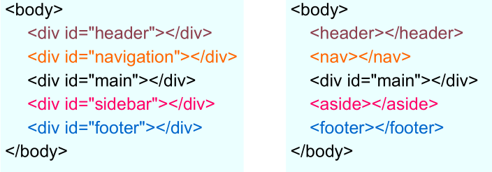
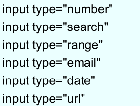

#### HTML5是什么？


HTML5属于最新的一项Web标准，在原有HTML4的基础上定义了一些**新的标签和 JavaScript API**。是HTML4标准的一个超集。
HTML5现在仍处于发展阶段，目标是取代现有的HTML 4.01和XHTML 1.0 标准。希望能够减少互联网富应用(RIA)对Flash、Silverlight、JavaFX等的依赖，提供更多能有效增强网络应用的API。

#### HTML5的设计理念

一、避免不必要的复杂性

+ 文档声明（验证器）

```html
HTML 4.01 Strict
<!DOCTYPE HTML PUBLIC "-//W3C//DTD HTML 4.01//EN""http://www.w3.org/TR/html4/strict.dtd">
HTML 5
<!DOCTYPE html>
```

+ `<script>` 元素 `<link>`元素

```html
<!--可以去掉type属性-->
<script type="text/javascript"></script>
<link rel="stylesheet" type="text/css" />
```

+ 字符编码

```html
HTML 4
<meta http-equiv=“Content-Type” content=“text/html; charset=utf-8”/>
HTML5
<meta charset="utf-8" />
```

二、支持已有的内容

- 可以省略结束标签的元素：`li、p、option、tr、td、th、thead、tbody、tfoot`
- 可以省略全部标签的元素：`html、head、body` 

> 注意：即使标签被省略了，该元素还是以隐式的方式存在的。例如将body元素的标签省略不写时，它在文档结构中仍是存在的，可以使用 document.body 进行访问。

三、求真务实



四、优雅降级
HTML5中设计了这些新元素，但是如果浏览器不认识, 怎么办?



**在浏览器看到自己不理解的type值时，会将type的值解释为text**

