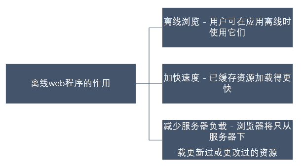

### 离线web应用的作用

#### web程序的优势和劣势

+ 优势：可以实时更新程序，程序总是从网络请求

+ 劣势：在新窗口重新访问该网页，在断网状态下打开的还是原来页面，加载完网页后突然断网，刷新页面后内容没有了

**理想状态下的web应用：**

+ 在线时获得最新的应用
+ 在本地存储应用资源，无论是否在线都可以使用（`HTML5` 提供离线Web应用的实现机制。使Web应用可以在用户离线的状态下进行访问）

#### 离线web程序的作用

#### 本地缓存与浏览器网页缓存的区别

**应用范围**

- 本地缓存是为整个Web应用程序服务的，且只缓存指定的网页；
- 而浏览器的网页缓存只服务于单个网页，任何网页都具有网页缓存。

**可靠性**

- 本地缓存是可靠的，可控制的；
- 而网页缓存是不安全、不可靠的。

### 创建离线应用

