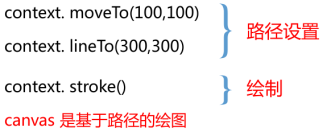
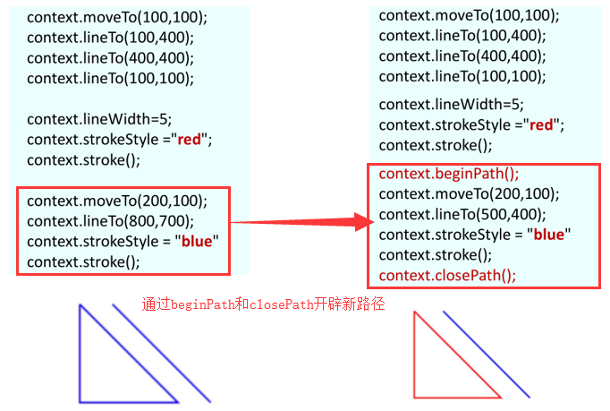
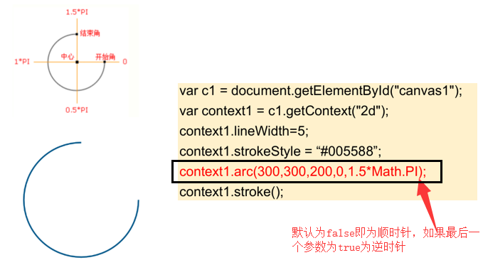
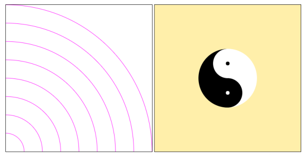
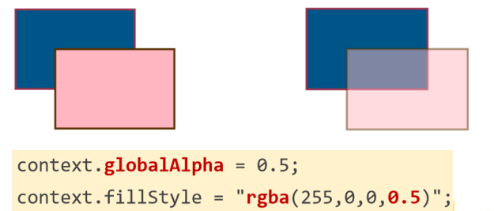
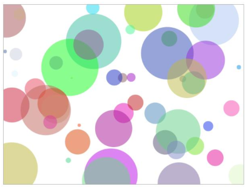

#### 创建canvas

##### canvas简介

- HTML5 canvas 元素用于**绘制图形**。canvas 元素只是一块无色透明的图形容器区域，需要利用 JavaScript 脚本来完成绘画。
- 画布是一个**空白矩形区域**，可以控制其每一像素。
- 可以通过多种方法使用 canvas 绘制路径、矩形、圆形、字符以及添加图像。

##### 创建Canvas元素

```html
<!--canvas元素中间放置的是当浏览器不兼容canvas时的内容-->
<canvas id="canvas1" width="200" height="100">
	您的浏览器不支持 canvas 元素，请更换或更新浏览器
</canvas>
```

- canvas默认大小是300*150
- 建议直接设置width和height属性，同时改变canvas元素的大小和元素绘图表面的大小。

> 如通过CSS来设定，则只会改变canvas的大小。当canvas元素的大小和绘图表面的大小不一致时，浏览器会对绘图表面进行缩放，使其符合元素的大小。如果只通过css来改变canvas的大小，里面的内容不会发生改变，里面的内容不会随着画布的大小进行缩放）

##### 在Canvas中绘制图形的步骤

使用`<canvas>`元素，首先需要调用getContext( )方法。

getContext() 方法可返回一个对象，该对象提供了用于在画布上绘图的方法和属性。**context被称为绘图环境对象**，包含绘图的上下文环境。

- 在页面添加 canvas 元素，定义 id 属性以便后续调用。

  `<canvas id="myCanvas" width="500" height="500"></canvas>`

- 使用id寻找 canvas 元素。

  `var canvas = document.getElementById("myCanvas");`

- 通过 canvas 元素的 getContext 方法来获取其上下文，创建Context 对象，以获取允许进行绘制的 2D 环境。

  `var context = canvas.getContext("2d");` 该方法可以接受两个值：**2d和3d**，分别表示二维和三维

- 使用 JavaScript 进行绘制。

#### 绘制直线、多边形

##### Canvas坐标

canvas 是一个二维网格。canvas 坐标原点 (0,0) 位于 canvas 的左上角。x 轴水平向右延伸，y轴垂直向下延伸。


##### 路径和描绘

- moveTo(x,y) 用于创建新的子路径，并规定其起始点为（x,y）。
- lineTo(x,y) 为当前子路径添加一条直线。这条直线从当前点开始，到 (x, y)结束。当方法返回时，当前点是 (x,y) 。
- stroke( ) 实际地绘制出通过 moveTo() 和 lineTo() 方法定义的路径。**默认颜色是黑色**。



```html
<!DOCTYPE html>
<html>
	<head>
		<meta charset="UTF-8">
		<title>canvasdemo</title>
		<style type="text/css">
			#canvas{border:1px solid red;}
		</style>
	</head>
	<body>
		<canvas id="canvas" width="500" height="500"></canvas>
		<script type="text/javascript">
			var canvas = document.querySelector("#canvas"),
				context = canvas.getContext("2d");
  			context.moveTo(100,100);
 			context.lineTo(300,300);
 			context.lineTo(100,300);
 			context.lineTo(100,100);
            context.stroke();
         /*
         注意事项：
         1. moveTo(x,y) 只是设置起点并不画线 。
         2. 如果没有用moveTo() 规定子路径的起点，则 lineTo(x,y)等同于moveTo(x,y)。
         3. 连完一条线后起点改变，改变为 lineTo(x,y) 中的坐标。
         */
		</script>
	</body>
</html>
```

##### 线条样式设置和填充

- `lineWidth` 属性 设置当前线条的宽度，默认单位为像素
- `strokeStyle` 属性 设置用于绘制描边的颜色


- `fill()` 方法 填充当前绘图（路径）。默认颜色是黑色。如果路径未关闭，那么 `fill()` 方法会自动从路径结束点到开始点之间添加一条线，以关闭该路径，然后填充该路径。
- `fillStyle` 属性设置用于填充绘画的颜色。

```html
<!DOCTYPE html>
<html>
	<head>
		<meta charset="UTF-8">
		<title>canvasdemo</title>
		<style type="text/css">
			#canvas{border:1px solid red;}
		</style>
	</head>
	<body>
		<canvas id="canvas" width="500" height="500"></canvas>
		<script type="text/javascript">
			var canvas = document.querySelector("#canvas"),
				context = canvas.getContext("2d");
            context.moveTo(100,100);
			context.lineTo(300,300);
			context.lineTo(100,300);
			context.lineTo(100,100);
			context.lineWidth=5;// 设置线条的宽度
			context.strokeStyle = 'blue'; // 设置绘制的颜色
			context.fillStyle = 'red'; // 设置填充颜色
			context.fill();
			//context.stroke(); // 如果需要同时绘制和填充，建议先填充后绘制
		</script>
	</body>
</html>
```

##### 深入canvas基于路径绘图

- beginPath( ) 开始一条新的路径（路径开始点）
- closePath( )  创建从当前点到开始点的路径（会在结束点和开始点之间连接一条直线）。关闭一条打开的子路径。
- canvas 之中只能有一条路径存在，称之为“当前路径”(current path) 。



##### 练习：七巧板

```html
<!DOCTYPE html>
<html>
	<head>
		<meta charset="UTF-8">
		<title>七巧板</title>
	</head>
	<body>
		<canvas id="canvas" width="400" height="400"></canvas>
		<script type="text/javascript">
          var canvas = document.querySelector("#canvas"),
              context = canvas.getContext("2d");
			
          const path = {
            obj1:{moveto:[0,0],lineto:[[200,200],[400,0]],color:'rgb(202,255,103)'},
            obj2:{moveto:[400,0],lineto:[[400,200],[300,300],[300,100]],color:'rgb(239,61,97)'},
            obj3:{moveto:[300,100],lineto:[[200,200],[300,300]],color:'rgb(249,245,26)'},
            obj4:{moveto:[200,200],lineto:[[300,300],[200,400],[100,300]],color:'rgb(165,148,192)'},
            obj5:{moveto:[100,300],lineto:[[200,400],[0,400]],color:'rgb(252,142,204)'},
            obj6:{moveto:[0,400],lineto:[[0,0],[200,200]],color:'rgb(103,190,207)'},
            obj7:{moveto:[400,200],lineto:[[200,400],[400,400]],color:'rgb(246,202,41)'}
          }
			
          for(var i in path){
            context.beginPath();
            context.moveTo(path[i].moveto[0],path[i].moveto[1]);
            for(var j = 0;j<path[i].lineto.length;j++){
              context.lineTo(path[i].lineto[j][0],path[i].lineto[j][1]);
            }
            context.fillStyle = path[i].color;
            context.fill();
            context.closePath();
          }
		</script>
	</body>
</html>
```

#### 绘制弧和圆

##### 弧/曲线

`arc()` 方法创建弧/曲线（用于创建圆或部分圆）

```markdown
# context.arc(x, y, r, sAngle, eAngle, anticlockwise)
x:圆的中心的 x 坐标。
y:圆的中心的 y 坐标。
r:圆的半径。
sAngle:起始角，以弧度计
eAngle:结束角，以弧度计。
anticlockwise:可选，是否按照逆时针方向绘图。false = 顺时针 true = 逆时针
```



##### 练习：分别实现下列三个图形




```html
<!DOCTYPE html>
<html>
	<head>
		<meta charset="UTF-8">
		<title>canvasdemo</title>
		<style type="text/css">
			#canvas{border:1px solid red;background-color: #FFFF00;}
		</style>
	</head>
	<body>
		<canvas id="canvas" width="400" height="400"></canvas>
		<script type="text/javascript">
			var canvas = document.querySelector("#canvas"),
				context = canvas.getContext("2d");
			/* example1
			for(var i = 0;i<10;i++){
				context.beginPath();
				context.arc(50 + i*100,100,40,0,2*Math.PI*(i+1)/10,false);
				context.closePath();// 这个必须放置在stroke前面
				context.stroke();
			}*/
			/* example2
			for(var i= 0;i<8;i++){
				context.strokeStyle = 'red';
				context.beginPath();// 不加上beginPath会把上一个的终点连接上下一个的起点
				context.arc(0,400,50 + i*50,0,1.5*Math.PI,true);
				//context.closePath(); 不加closePath就不会把图形的终点和起点进行连接
				context.stroke();
			}*/
          	/* example3
			// 画大圆
			context.beginPath();
			context.arc(200,200,80,1.5*Math.PI,0.5*Math.PI,false);
			context.strokeStyle = 'white'
			context.fillStyle = 'white';
			context.fill();
			context.closePath();
			
			context.beginPath();
			context.arc(200,200,80,1.5*Math.PI,0.5*Math.PI,true);
			context.strokeStyle = 'black'
			context.fillStyle = 'black';
			context.fill();
			context.closePath();
			
			// 画小圆
			context.beginPath();
			context.arc(200,160,40,0,2*Math.PI,true);
			context.strokeStyle = 'white'
			context.fillStyle = 'white';
			context.fill();
			context.closePath();
			
			context.beginPath();
			context.arc(200,240,40,0,2*Math.PI,true);
			context.strokeStyle = 'black'
			context.fillStyle = 'black';
			context.fill();
			context.closePath();
			
			//画小小圆
			context.beginPath();
			context.arc(200,160,4,0,2*Math.PI,true);
			context.strokeStyle = 'black'
			context.fillStyle = 'black';
			context.fill();
			context.closePath();
			
			context.beginPath();
			context.arc(200,240,4,0,2*Math.PI,true);
			context.strokeStyle = 'white'
			context.fillStyle = 'white';
			context.fill();
			context.closePath();

			context.stroke();
            */
		</script>
	</body>
</html>
```

#### 绘制矩形

- `rect(x，y，width，height);` 创建矩形
- `fillRect(x，y，width，height);` 绘制 "已填色" 的矩形（实心）
- `strokeRect(x，y，width，height);` 绘制不填色的矩形（空心）
- `clearRect(x，y，width，height);` 清空给定矩形内的指定像素

```markdown
# context.rect(x, y, width, height)
x，y 指定矩形左上角的位置
width，height 指定矩形的尺寸
与 fill( ) 和 stroke( ) 搭配使用
```

#### 透明度

`globalAlpha` 属性：设置绘图的当前透明值。



**练习：在画布上绘制50个任意大小、任意位置、透明度为0.5的任意颜色的圆形。**



```html
<!DOCTYPE html>
<html>
	<head>
		<meta charset="UTF-8">
		<title>canvasdemo</title>
		<style type="text/css">
			#canvas{border:1px solid red;}
		</style>
	</head>
	<body>
		<canvas id="canvas" width="400" height="400"></canvas>
		<script type="text/javascript">
			var canvas = document.querySelector("#canvas"),
				context = canvas.getContext("2d");
			context.globalAlpha = 0.5;
			function randomcolor() {
        		return '#' + Math.random().toString(16).slice(-6);
    		}
            // 生成随机颜色
          	/*
          	var R = Math.floor(Math.random() * 255);
	        var G = Math.floor(Math.random() * 255);
	        var B = Math.floor(Math.random() * 255);
	        context.globalAlpha = Math.random()*0.7+0.3;
	
	        context.fillStyle = "rgb(" + R + "," + G + "," + B + ")";
          	*/
			
			for(var i = 0;i<50;i++){
				context.beginPath();
				context.fillStyle = randomcolor();
			context.arc(Math.random()*400,Math.random()*400,Math.random()*40,0,2*Math.PI,false);
				context.closePath();
				context.fill();
			}
		</script>
	</body>
</html>
```

