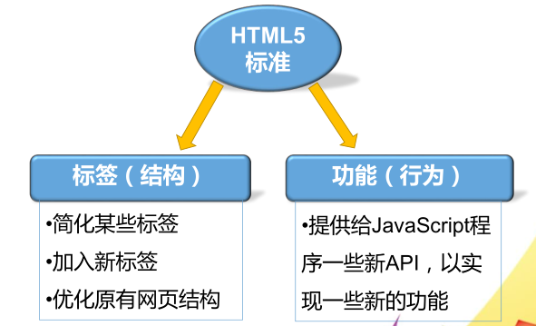
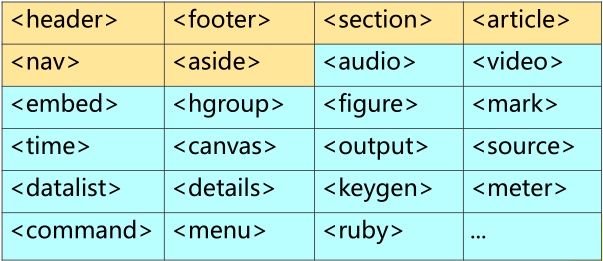
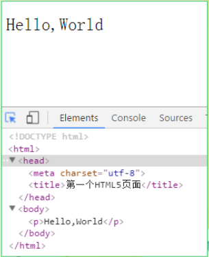
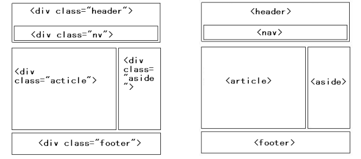
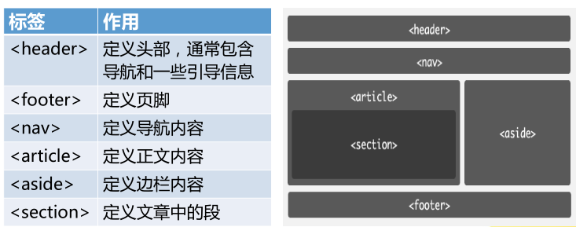
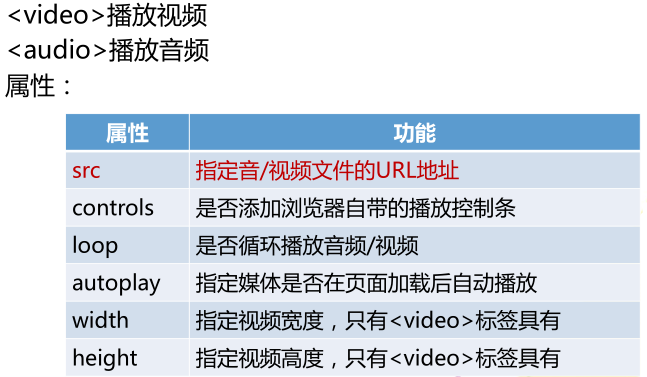
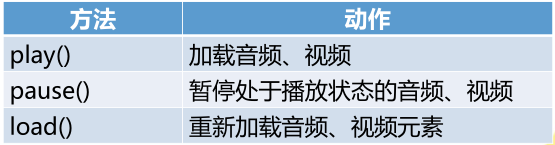
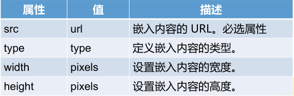
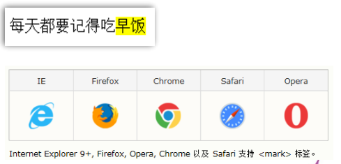
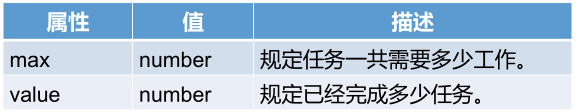

#### HTML5标签特性



**HTML5新标签分类**

+ 优化文档结构，语义化标签


+ 提供新的功能 例如：`<audio>、<video>、<canvas>`



**第一个HTML5页面**



```html
<!DOCTYPE html>
	<meta charset="utf-8"/>
	<link rel="icon" href="img/snowflake.png" />
	<title>第一个HTML5页面</title>
	<p>Hello,World</p>
<!--未写完全页面，可以实现相应的内容，浏览器在解析的时候会自动进行补全，上述的link是设置自己的icon-->
```

#### HTML5新增的结构性元素

- HTML5定义了一组新的语义化标签来描述元素的内容。
- 语义化标签的好处是简化HTML网页设计，并且让机器可以更好地理解网页，以促进信息的共享和传播。
- 搜索引擎在抓取和索引网页时会利用这些元素，如移动设备，爬虫程序或者其他程序。





##### header元素

header元素是一种具有引导和导航作用的结构元素，通常用来放置整个页面或页面内的一个内容区块的**标题、搜索表单、相关的LOGO图片**等。

```html
<header> <h1>页面标题</h1> </header>
<!--一个网页内不限制只能有一个header元素，可以拥有多个，可以为每个内容区域块添加header元素。-->
```

##### nav元素

nav元素定义**页面导航**的链接组，其中的导航元素链接到其他页面或当前页面的其他部分。

```html
<nav>
  <ul>
    <li><a href="/">主页</a></li>
    <li><a href="/events">开发文档</a></li>
  </ul>
</nav>
```

+ 网页可以拥有多个nav元素，作为页面整体或不同部分的导航。


+ 并不是所有的链接都要放进nav元素，如果文档中有“前后”按钮，则可以把它放到 `<nav>` 元素中。

##### article元素

article元素定义**可以独立被外部引用**的内容。可以是一篇博客、一段评论…

```html
<article>
  <header>
  	<h1>苹果</h1>
  </header>
  <p>苹果，植物类水果，多次花果... </p>
  <footer>
  	<p>著作权归*公司所有。</p>
  </footer>
</article>
<!--一个article元素通常有自己的标题和脚注。-->
```

##### section元素

section元素定义**文档中的区域**。比如章节、页眉、页脚或文档中的其他部分。

```html
<section>
  <h1>PRC</h1>
  <p>The People's Republic of China was born in 1949...</p>
</section>
```

##### aside元素

aside元素用来表示当前页面或文章的**附属信息**。

+ 包含在article元素中，作为主要内容的附属信息部分，内容可以是与当前文章有关的相关资料、名次解释，等等。


+ 在article元素之外，作为页面或站点全局的附属信息。最典型的是侧边栏，内容包括友情链接，博客中的文章列表、广告等。

```html
<!--第一种情况-->
<article>
  	<h1>…</h1>
  	<p>…</p>
	<aside>…</aside>
</article>
<!--第二种情况-->
<aside>
	<h2>…</h2>
	<ul>
		<li>…</li>
	</ul>
</aside>
```

##### footer元素

footer元素定义**页脚**。通常包括其相关区块的脚注信息，如作者、文档的创作日期以及版权信息等。

> 一个页面中不限制只可以用一个footer元素。可以为article元素或section元素添加footer。

```html
<footer>
  <ul>
    <li>版权信息</li>
    <li>站点地图</li>
    <li>联系方式</li>
  </ul>
</footer>
```

##### 结构性标签案例

```html
<!DOCTYPE HTML>
<html>
	<head>
		<meta charset="UTF-8"/>
		<title>html结构</title>
	</head>
	<body>
		<header>
			<h1>网页标题</h1>
		</header>
      	<nav>
          	<ul>
            	<li>首页</li>
            	<li>web前端</li>
          	</ul>
		</nav>
		<article>
			<header><h1>文章标题</h1></header>
			<p>文章正文</p>
			<section>文章描述内容</section>
			<footer>作者</footer>
		</article>
		<aside>
			<p>广告等信息</p>
		</aside>
		<footer>
			copyright....
		</footer>
	</body>
</html>
```

#### HTML5新增的功能性元素

##### video、audio

网页中的多媒体指要在网页上展示的音频、视频、动画。

HTML5中加入了对音频和视频的原生支持

- 优点：无需插件、提供JavaScript脚本控制的API
- 缺点：音/视频格式的支持有限



```html
<!DOCTYPE HTML>
<html>
	<head>
		<meta charset="UTF-8"/>
		<title>audio-video</title>
	</head>
	<body>
		<audio src="audio/1.mp3" controls="controls"></audio>
		<video src="video/1.ogg" controls="controls" loop="true" autoplay="false"></video>
	</body>
</html>
```

**音/视频格式兼容性解决方案**

- audio/video 组合source 元素。source 元素可以链接不同的音频文件，也可以为同一个媒体数据指定多个播放格式。
- 浏览器将使用第一个可识别的格式

```html
<!DOCTYPE html>
<html>
	<head>
		<meta charset="UTF-8">
		<title>source</title>
	</head>
	<body>
		<audio controls="controls">
			<source src="audio/1.mp3"/>
			<source src="audio/2.mp3"/>
			您的浏览器不支持audio
		</audio>
		<br />
		<br />
		<video controls="controls" width="320" height="240">
			<source src="video/1.ogg"/>
			<source src="video/2.ogg"/>
			您的浏览器不支持video
		</video>
	</body>
</html>
```

**更灵活的音/视频操作**

通过JavaScript API可以更灵活的控制音/视频，并实现更丰富的功能

常用控制函数



##### 练习：音乐播放器

```html
<!DOCTYPE html>
<html>
	<head>
		<meta charset="UTF-8">
		<title>音乐播放器</title>
		<style>
			div{width: 320px;height:240px;border: 1px solid #333;}
			div li{list-style: none;margin-top: 6px;font-size:14px;margin-left: 6px;}
			div li span{float: right;margin-right: 6px;color:blue;cursor: pointer;text-decoration: underline;}
			audio{width:320px;margin-top: 5px;}
		</style>
		<script>
		window.onload = function(){
			var play = document.getElementsByClassName("btn"),
				audios = document.getElementById("audios");
			for(var i = 0;i<play.length;i++){
				(function(j){
					play[j].onclick = function(){
						audios.setAttribute("src","audio/" + (j+1) + ".mp3");
						if(this.innerHTML == "播放"){
							audios.play();
							this.innerHTML = "暂停";
							for(var k = 0;k<play.length;k++){
								if(k!=j){
									play[k].innerHTML = "播放";
								}
							}
						}else{
							audios.pause();
							this.innerHTML = "播放";
						}
					}	
				}(i));
			}
		}	
		</script>
	</head>
	<body>
		<div>
			<li>情非得已<span class="btn">播放</span></li>
			<li>如果没有你<span class="btn">播放</span></li>
		</div>
		<audio controls="controls" id="audios" src="audio/1.mp3"></audio>
	</body>
</html>
```

##### embed

`<embed>`定义嵌入的内容，比如插件。属性：



##### time

- `<time>`定义公历的时间（24 小时制）或日期
- `<time>` 标签不会在浏览器中呈现任何特殊效果。
- 该元素能够以机器可读的方式对日期和时间进行编码，搜索引擎也能够生成更智能的搜索结果。

```html
<!--time不会有任何的效果，只是本身给搜索引擎提供方便-->
<p>我们在每天早上 <time>8:00</time> 开始上课</p>
<p>我在 <time datetime=“2018-10-1”>国庆节</time> 有个约会</p>
```

##### details

- `<details>` 标签用于描述文档或文档某个部分的细节。
- 与 `<summary>` 标签配合使用可以为 details 定义标题。标题是可见的，用户点击标题时，会显示出 details。

```html
<details>
  <summary>Copyright 2018.</summary>			
  <p>版权归H5方向所有.</p>
</details>
```

> 目前，只有 Chrome 和 Safari 6 支持 `<details>` 标签。

##### mark

`<mark>` 标签定义带有记号的文本。

```html
<p> 每天都要记得吃<mark>早饭</mark> </p>
```



##### progress

- `<progress>` 标签标示任务的进度（进程）。
- `<progress>` 标签与 JavaScript 一同使用，来显示任务的进度。

```html
<progress value="25" max="100"> </progress>
```



```html
<!DOCTYPE html>
<html>
	<head>
		<meta charset="UTF-8">
		<title>demo</title>
	</head>
	<body>
		<embed src="http://www.baidu/com" />
		<!--time不会有任何的效果，只是本身给搜索引擎提供方便-->
		<p>今天早上<time>6:00</time>起床</p>
		<details>
			<summary>Copyright 2018.</summary>			
			<p>版权归H5方向所有.</p>
		</details>
		<progress value="25" max="100"> </progress>
	</body>
</html>
```

