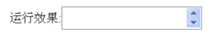
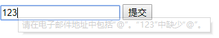
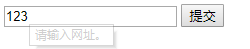
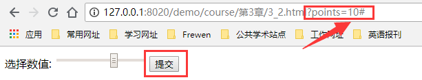
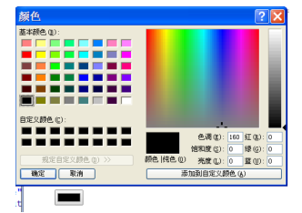
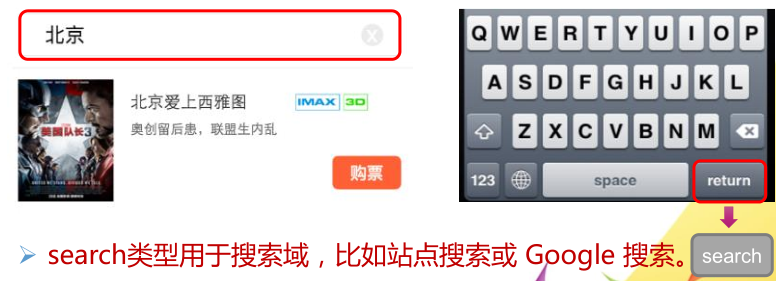

#### 新增input输入类型

##### 数值输入文本框

```html
<input type="number" name="demoNum" min="1" max="100" step="2"/>
注：外观与text文本框相同，但不能输入数值以外的文字，否则提交时将内容作为空白进行提交。
```



- name : 用来标识表单提交时的key值
- min : 当前输入框输入的最小值
- max : 最大值
- step：步长，点击增大或者减小时增加减少的步长

##### 邮箱输入文本框

```html
<input type="email" name="email" placeholder="请输入邮箱" />
注：专门用来输入email地址。当表单提交时，会自动校验是否符合邮箱的正则表达式，但不检验该email地址是否存在。
```



##### url输入文本框

```html
<input type="url" placeholder= "输入正确的网址" />
注：专门用来输入url地址。当表单在提交前，会自动校验是否符合url网址的规范。
```



##### 电话号码输入文本框

```html
<input type="tel" placeholder="输入电话" name="p"/>
 注：手机中的浏览器遇到tel类型的input元素时，会自动变换触摸屏幕键盘以方便用户输入。更加适合于移动端
```

##### 滑动条输入文本框

```html
<input type="range" min="0" max="50" step="5" name="rdemo" value="0" />
注：用于应该包含一定范围内数字值的输入域。range 类型显示为滑动条。能够设定对所接受的数字的限定。
```



##### 日期时间输入文本框

```html
<input type="date" name="datedemo" />
注：date类型的input元素以日历的形式方便用户输入。还有其他的type：time、datetime-local、month 、week、datetime。
```


##### 颜色选择文本框

```html
<input type="color" name="col"/>
注：color类型的input元素用来选取颜色，其提供了一个颜色选择器。
```



##### 搜索功能文本框

```html
<input type= " search" name="movie"/>
```



#### 新增表单元素

##### datalist

datalist 元素——为输入框提供可选的列表。

- 列表通过 datalist 中的 option 元素创建。如不从列表中选择某项，也可自行输入其他内容。
- 把 datalist 绑定到输入域，需将输入域的 list 属性引用 datalist的 id。
- 每个option元素都必须设置value属性。

