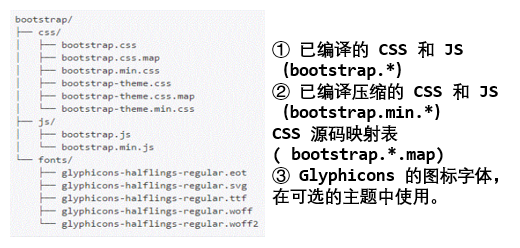
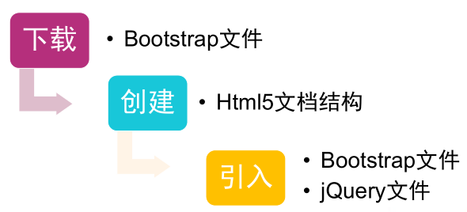
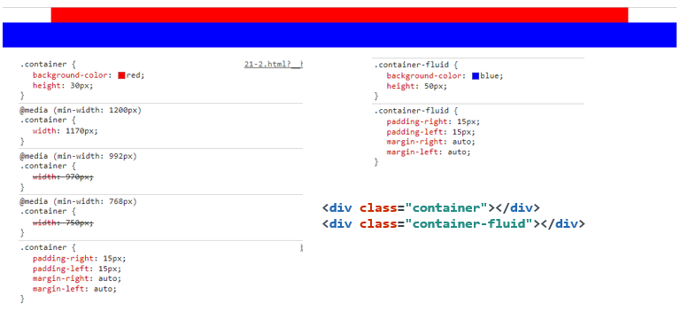
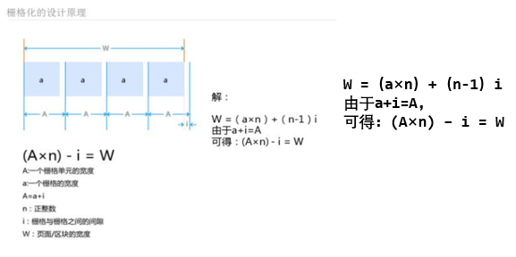
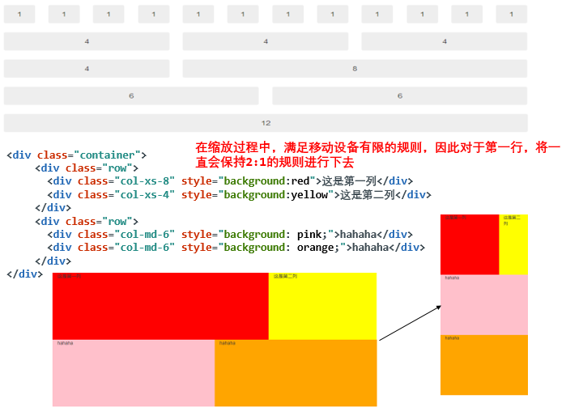

#### 初识 Bootstrap

- Bootstrap 是在2011年，由twitter的“一小撮”工程师为了提高内部的协调性和工作效率，用业余时间为他们的产品构建的一套易用、优雅、灵活、可扩展的前端工具集。
- 简单灵活，用于快速开发 Web 应用程序和网站的前端框架。
- 基于HTML、CSS、JavaScript并且是响应式的开发

##### Bootstrap的优势与不足

+ 移动设备优先：自 Bootstrap 3 起，框架包含了贯穿于整个库的移动设备优先的样式。（即可以实现可以优先满足小的移动设备的要求）


+ 浏览器支持：所有的主流浏览器都支持 Bootstrap。


+ 容易上手：只要具备 HTML 和 CSS 的知识，就可以开始学习。


+ 响应式设计：响应式 CSS 能够自适应于台式机、平板电脑和手机。


+ 包含了功能强大的内置组件，易于定制。


+ 开源。

**缺点：不方便修改样式，对细节的不好把握，可能生成相同的类名**

##### Bootstrap包含的内容

- 基本结构：提供了一个带有网格系统、链接样式、背景的基本结构。
- CSS：全局的 CSS 设置、定义基本的 HTML 元素样式、可扩展的 class，以及一个先进的网格系统。
- 组件：可重用的常见界面组件，用于创建进度条、下拉菜单、导航、按钮组、分页等等。
- JavaScript 插件：和组件类似，用来实现提示、弹出框、模态对话框、
- 轮播等具有交互性的组件。
- 定制：可以定制 Bootstrap 的组件、LESS 变量和 jQuery 插件来得到自定义版本。

#### Bootstrap环境安装

##### 下载Bootstrap

资源下载：http://v3.bootcss.com/getting-started/

+ 下载Bootstrap：编译并压缩后的 CSS、JavaScript 和字体文件或者下载源码Less、JavaScript 和 字体文件的源码，并且带有文档。需要 Less编译器和一些设置工作。


+ 使用 BootCDN 提供的免费 CDN 加速服务（同时支持 http 和https 协议）

```html
<!-- jQuery文件。务必在bootstrap.min.js 之前引入 -->
<script src="http://cdn.static.runoob.com/libs/jquery/2.1.1/jquery.min.js"></script>
<!-- 最新版本的 Bootstrap 核心 CSS 文件 -->
<link rel="stylesheet" href="https://cdn.bootcss.com/bootstrap/3.3.7/css/bootstrap.min.css">
<!-- 可选的 Bootstrap 主题文件（一般不用引入） -->
<link rel="stylesheet" href="https://cdn.bootcss.com/bootstrap/3.3.7/css/bootstrap-theme.min.css">
<!-- 最新的 Bootstrap 核心 JavaScript 文件 -->
<script src="https://cdn.bootcss.com/bootstrap/3.3.7/js/bootstrap.min.js"></script>
```

+ Bootstrap 的所有插件都依赖 jQuery，因此 jQuery 必须在 Bootstrap之前引入！

预编译Bootstrap的文件/目录结构：



##### 基本的html模板

```html
<!DOCTYPE html>
<html>
<head>
    <meta charset="utf-8"/>
    <meta http-equiv="X-UA-Compatible" content="IE=edge"/>
    <meta name="viewport" content="width=device-width, initial-scale=1"/>
    <title>Bootstrap基本结构</title>
  	<link href="css/bootstrap.min.css" rel="stylesheet"/>
	<script src="js/jquery.js"/></script>
	<script src="js/bootstrap.min.js"/></script>
</head>
<body>
    <h1>你好，世界！</h1>
</body>
</html>
```

##### Bootstrap基本流程



#### Bootstrap CSS概览

+ 全局设置：HTML 5 文档类型（Doctype）

Bootstrap 使用了一些 HTML5 元素和 CSS 属性。必须使用HTML5文档类型。

```html
<!DOCTYPE html>
<html>
...
</html>
```

+ 移动设备优先

为了确保适当的绘制和触屏缩放，需要在 `<head>` 之中添加`viewport` 元数据标签。

1. 设备上的 viewport 指设备的屏幕上能用来显示网页的那一块区域。
2. 添加 viewport 元数据标签可确保适当的绘制和触屏缩放。

```html
<meta name="viewport" content="width=device-width,initial-scale=1"/>
<!--
Viewport 的属性如下：
width=device-width ：表示宽度是设备屏幕的宽度
initial-scale=1.0：表示初始的缩放比例
minimum-scale=0.5：表示最小的缩放比例
maximum-scale=2.0：表示最大的缩放比例
user-scalable=yes/no：表示用户是否可以调整缩放比例
-->
```

+ 排版和链接

Bootstrap 排版、链接样式设置了基本的全局样式。分别是：

1. 为 body 元素设置 background-color: #fff;
2. 使用 @font-family-base、@font-size-base 和 @line-height-base a变量作为排版的基本参数
3. 为所有链接设置了基本颜色 @link-color ，并且当链接处于 :hover 状态时才添加下划线`scaffolding.less`

+ 布局容器

container 类、container-fluid类用于包裹页面上的内容。

1. `.container` 类用于固定宽度并支持响应式布局的容器。
2. `.container-fluid` 类用于 100% 宽度，占据全部视窗的容器。

> 注意说明：!!两种容器类不能互相嵌套



#### 栅格系统

- 在平面设计中，网格是一种由一系列用于组织内容的相交的直线（垂直的、水平的）组成的结构（通常是二维的）。广泛应用于打印设计中的设计布局和内容结构。
- 在网页设计中，栅格系统以规则的网格阵列来指导和规范网页中的版面布局以及信息分布。可以让网页的信息呈现更加美观易读，更具灵活、规范和可用性。

##### 栅格系统的设计原理

在网页设计中，把宽度为“W”的页面分割成n个网格单元“a”，每个单元与单元之间的间隙设为“i”，把“a+i”定义“A”。



##### Bootstrap栅格系统

Bootstrap提供了一套**响应式**、**移动设备优**先的流式栅格系统，随着屏幕或视窗（viewport）尺寸的增加，系统会自动分为最多12列。

+ 基本栅格： `.row .col-md-*`



```html
<!DOCTYPE html>
<html>
  <head>
    <title>栅格系统</title>
    <meta charset="utf-8"/>
    <meta name="viewport" content="width=device-width, initial-scale=1.0">	
    <link rel="stylesheet" href="css/bootstrap.min.css">	
    <style>
    	div{height: 200px;}
    </style>
  </head>
  <body>
		<div class="container">
			<div class="row">
			  <div class="col-xs-8" style="background:red">这是第一列</div>
			  <div class="col-xs-4" style="background:yellow">这是第二列</div> 
			</div>
			<div class="row">
				<div class="col-md-6" style="background: pink;">hahaha</div>
				<div class="col-md-6" style="background: orange;">hahaha</div>
			</div>
		</div>
		<script src="js/jquery.js"></script>    
		<script src="js/bootstrap.min.js"></script>
  </body>
</html>
```

**注意：**

+ 行（row）必须要包含在容器（container）之内


+ 使用行（row）在水平方向创建一组列（col） -- 对于列里面可以继续嵌套行


+ 内容应当放置于列内，而且，只有列可以作为行的直接子元素。


+ 类似.row 和.col-md-4 这些预定义的栅格类可用来快速创建栅格布局。


+ 通过设置 padding 创建列之间的间隔。


+ 栅格系统中的列是通过指定1到12的值来表示其跨越的范围。例如，三个等宽的列可以使用三个.col-md-4来创建。


+ 如果一“行（row）”中包含了的“列（col）”大于 12，多余的列所在的元素将被作为一个整体另起一行排列。

##### 深入理解栅格系统

原码分析

```css
.col-xs-1, .col-sm-1, .col-md-1, .col-lg-1, .col-xs-2, {
/*后面代码省略，选择了所有的列*/
  position: relative;
  min-height: 1px;
  padding-right: 15px;
  padding-left: 15px;
}
.col-xs-1, .col-xs-2, .col-xs-3, .col-xs-4, .col-xs-5, .col-xs-6, .col-xs-7, .col-xs-8, .col-xs-9, .col-xs-10, .col-xs-11, .col-xs-12 {float: left; }
.col-xs-12 { width: 100%;}
.col-xs-11 { width: 91.6666667%;}
.col-xs-10 { width: 83.3333333%;}
.col-xs-9 { width: 75%; }
.col-xs-8 { width: 66.66666667%;}
.col-xs-7 { width: 58.33333333%;}
.col-xs-6 { width: 50%; }
.col-xs-5 { width: 41.66666667%;}
.col-xs-4 { width: 33.33333333%;}
.col-xs-3 { width: 25%;}
.col-xs-2 { width: 16.66666667%;}
.col-xs-1 { width: 8.33333333%;}
```

容器container 的设计如下：