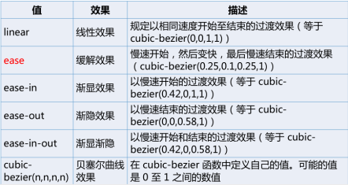
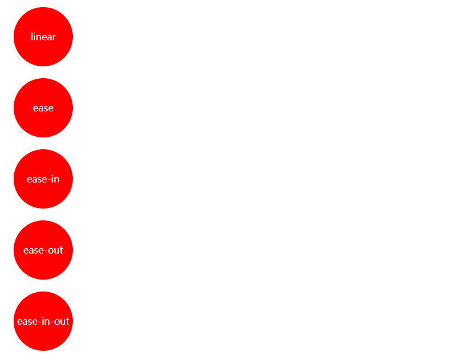
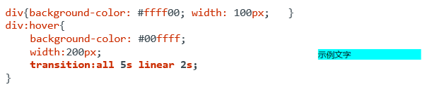
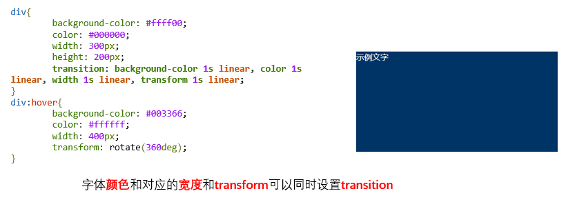
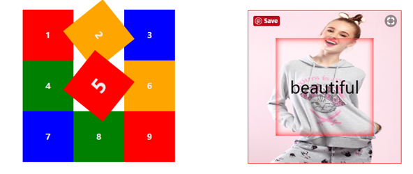
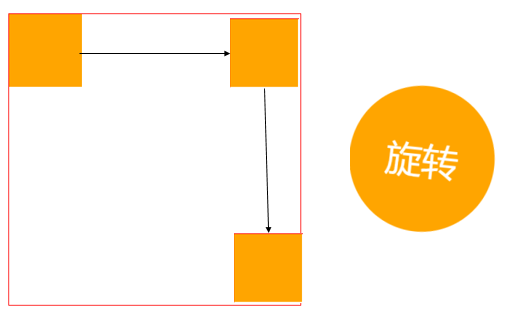

#### 过渡

##### transition

CSS3 transform 属性所实现的元素变形，呈现的仅仅是一个“结果”，而 transition 呈现的是一种过渡“过程”，即一种动画转换过程，如渐显、渐隐、动画快慢等。
transition 通过将元素的某个属性从一个属性值在指定的时间内平滑过渡到另一个属性值来实现动画功能

语法：

| 值                          | 描述                      |
| -------------------------- | ----------------------- |
| transition-property        | 规定设置过渡效果的 CSS 属性的名称。    |
| transition-duration        | 规定完成过渡效果需要的时间。默认是 0。    |
| transition-timing-function | 规定过渡效果的时间曲线。默认是 "ease"。 |
| transition-delay           | 定义过渡效果何时开始。默认是 0。       |

+ `transition-property` 指定参与过渡的属性，语法格式如下：

```css
transition-property：all | none | <property>[ ,<property> ]*
/*
• all：默认值，表示所有可以进行过渡的 CSS 属性；
• none：表示不指定过渡的 CSS 属性；
• <property>：表示指定要进行过渡的 CSS 属性。可以同时指定多个属性值，以逗号“,”进行分隔。
*/
```

+ `transition-duration` 属性指定过渡持续的时间，即设置从旧属性换到新属性花费的时间（以秒或毫秒计）。语法格式如下：

```css
transition-duration：<time>[ ,<time> ]*
/*
<time>默认值为0，适用于所有元素以及:before和:after伪元素，如果存在多个属性值，以逗号“,”进行分隔。
*/
```

+ `transition-delay` 属性规定在过渡效果开始之前需要**等待**的时间，以秒或毫秒计。语法格式如下：

```css
transition-delay: time
/*
• 默认值为0，适用于所有元素以及:before 和 :after伪元素。
• 设置时间可以为正整数、负整数和0。非零时必须设置单位为秒s或者毫秒ms。为负数时过渡的动作会从该时间点开始显示，之前的动作被截断；为正数的时候，过渡的动作会延迟触发。
*/
```

+ `transition-timing-function` 属性规定过渡效果的速度曲线。语法格式如下：

```css
transition-timing-function：linear | ease | ease-in | ease-out | ease-in-out | cubic-bezier(x1,y1,x2,y2);
```



```css
div:nth-child(1):hover{transition-timing-function: linear;/*匀速运动*/}
div:nth-child(2):hover{transition-timing-function: ease;/*先快后慢*/}
div:nth-child(3):hover{transition-timing-function: ease-in;/*先慢后快*/}
div:nth-child(4):hover{transition-timing-function: ease-out;/*先快后慢*/}
div:nth-child(5):hover{transition-timing-function: ease-in-out;/*先慢后快后慢*/}
```



##### 合写方式


```css
transition: all .5s ease-in .1s;/*property duration timing-function delay*/
/*分开写的形式*/
transition-property: all;
transition-duration: .5s;
transition-timing-function: ease-in;
transition-delay: .1s;
```



**使用transition功能同时过渡多个属性值**

+ 如需向多个样式添加过渡效果，则添加多个属性，由逗号隔开：



##### 练习



```html
<!DOCTYPE html>
<html>
<head lang="en">
    <meta charset="UTF-8">
    <title>九宫格</title>
    <style>
        ul,li{list-style: none;}
        .boxes { width: 300px;}
      	/*设置transition*/
        .boxes .box {width: 100px;height: 100px;color: #eee;line-height: 100px;text-align: center;font-weight: bold;float: left;transition: font-size .8s ease, transform .8s ease;}
        .boxes .box:hover {font-size: 250%;transform: rotate(360deg);}
        .box-1 {background-color: red;}
        .box-2 {background-color: orange;}
        .box-3 {background-color: #0000ff;}
        .box-4 {background-color: #008000;}
        .box-5 {background-color: red;}
        .box-6 {background-color: orange;}
        .box-7 {background-color: #0000ff;}
        .box-8 {background-color: #008000;}
        .box-9 {background-color: red;}
    </style>
</head>
<body>
    <ul class=" boxes">
        <li class="box box-1">1</li>
        <li class="box box-2">2</li>
        <li class="box box-3">3</li>
        <li class="box box-4">4</li>
        <li class="box box-5">5</li>
        <li class="box box-6">6</li>
        <li class="box box-7">7</li>
        <li class="box box-8">8</li>
        <li class="box box-9">9</li>
    </ul>
</body>
</html>
```

```html
<!DOCTYPE html>
<html>
<head lang="en">
    <meta charset="UTF-8">
    <title></title>
    <style>
        *{padding:0;margin:0;}
        .box{width: 300px;height: 300px;outline: 1px solid red;position:relative;}
        .box div{
            position: absolute;
            top:0;
            left:0;
            height: 300px;
            width: 300px;
            line-height:300px;
            text-align: center;
            color: black;
            font-size: 50px;
            background: rgba(255,255,255,0.3);
            box-shadow: 0 0 30px red inset;
            transform: scale(0,0);
            transition: transform 1s ease-in-out;
        }
        .box:hover div{transform:scale(1,1);}
    </style>
</head>
<body>
<div class="box">
    
    <div>beautiful</div>
</div>
</body>
</html>
```

#### 动画

+ 通过 CSS3 创建动画，可以在许多网页中取代动画图片、Flash动画以及 JavaScript。动画效果使用 `animation` 属性来实现。

`animations` 功能与 `transitions` 功能的相似点与不同点？

+ 相似点：都是通过改变元素的属性值来实现动画效果。


+ 不同点：transitions 过渡只是通过指定属性的开始值与结束值，然后以在这两个属性之间进行平滑过渡的方式来实现简单动画效果。animations 动画则是通过定义多个关键帧以及定义每个**关键帧**中元素的属性值来实现更为复杂的动画效果。

在 CSS3 中，动画需要 2 步：
1. 制定动画关键帧
2. 调用动画

##### @keyframes 规则

@keyframes 规则用于创建动画。在其中规定某项 CSS 样式，就能创建由当前样式逐渐改为新样式的动画效果。在 @keyframes 中创建动画时，需要把它捆绑到某个选择器。

通过规定至少以下两项 CSS3 动画属性，即可将动画绑定到选择器：**规定动画的名称、动画的时长**

```txt
@keyframes 关键帧集合名 { 创建关键帧的代码 }
```

创建关键帧集合

```css
@keyframes mycolor{
    0%{background-color: red;}
    40%{background-color: darkblue;}
    70%{background-color: yellow;}
    100%{background-color: red;}
}
```

+ 开始帧


+ 背景色为深蓝色的关键帧在整个动画过程中40%处有一帧为背景色是深蓝色的关键帧。


+ 背景色为黄色的关键帧在整个动画过程中70%处有一帧为背景色是黄色的关键帧。


+ 结束帧：整个动画中最后一帧，在结束帧之后，元素的属性不再发生变化。

##### animation

`animation: name duration timing-function  delay iteration-count  direction;`

创建好关键帧集合之后，在元素的样式中使用该关键帧的集合。在animation-name属性中指定关键帧集合的名称。

|             值             | 描述                       |
| :-----------------------: | ------------------------ |
|      animation-name       | 规定需要绑定到选择器的 keyframe 名称。 |
|    animation-duration     | 规定完成动画所花费的时间，以秒或毫秒计。     |
| animation-timing-function | 规定动画的速度曲线。               |
|      animation-delay      | 规定在动画开始之前的延迟。            |
| animation-iteration-count | 规定动画应该播放的次数。             |
|    animation-direction    | 规定是否应该轮流反向播放动画。          |

+ `animation-iteration-count` 属性定义动画的播放次数。

```txt
animation-iteration-count : n | infinite;
(1) n 定义动画播放次数的数值，默认为1
(2) infinite 规定动画应该无限次播放。
```

实现多个属性值同时改变的动画

+ 在各关键帧中同时指定多个属性值可以实现多个属性值同时改变的动画。

```css
@keyframes mycolor{
	0%{background-color: red;transform: rotate(0deg);
	100%{background-color: red;transform: rotate(0deg);}
}/*设置了多个属性*/
```

##### 练习

**练习一：实现方块的滑动和旋转的无限次播放**



```html
<!--方块的移动-->
<!DOCTYPE html>
<html>
<head lang="en">
    <meta charset="UTF-8">
    <title></title>
    <style>
      	div {width: 400px;height: 400px;outline: 1px solid red;}
        div div {width: 100px;height: 100px;background: orange;position: relative;top: 0;left: 0;}
        div:hover {animation: mymove 2s 0.5s;}
        @keyframes mymove {0% {left: 0;top: 0;}50% {left: 300px;top: 0;}100% {left: 300px;top: 300px;}}
    </style>
</head>
<body>
<div>
    <div></div>
</div>
</body>
</html>
```

```html
<!--旋转-->
<!DOCTYPE html>
<html>
<head lang="en">
    <meta charset="UTF-8">
    <title>旋转</title>
    <style>
        div{width: 200px;height: 200px;line-height: 200px;text-align: center;font-size: 50px;color: white;background: orange;border-radius: 50%;}
        div:hover{animation: myRotate 2s linear 1s;animation-iteration-count: infinite;}
        @keyframes myRotate{0%{transform: rotate(0deg);}100%{transform: rotate(360deg)}}
    </style>
</head>
<body>
	<div>旋转</div>
</body>
</html>
```

**练习二：轮播图效果**


```html
<!DOCTYPE html>
<html>
<head lang="en">
    <meta charset="UTF-8">
    <title>幻灯片</title>
    <style>
        *{padding:0;margin:0;}
        .b0 {
            overflow: hidden;
            width: 680px;
            height: 320px;
            border: 5px solid #eaeaea;
            margin: 150px auto auto auto;
            position: relative;
        }

        .a1 {animation: a11 20s linear infinite;position: absolute;}
        @keyframes a11{
            0%{top:0;left:0;opacity:1;}
            15%{top:0;left:0;opacity:1;}
            20%{top:325px;left:0;opacity:0;}
            35%{top:325px;left:0;opacity:0;}
            40%{top:216px;left:0;opacity:0;}
            55%{top:216px;left:0;opacity:0;}
            60%{top:-216px;left:0;opacity:0;}
            75%{top:-216px;left:0;opacity:0;}
            80%{top:-325px;left:0;opacity:0;}
            95%{top:-325px;left:0;opacity:0;}
            100%{top:0;left:0;opacity:1;}
        }
        .a2{animation:a22 20s linear infinite;position:absolute;}
        @keyframes a22{
            0%{top:-325px;left:0;opacity:0;}
            15%{top:-325px;;left:0;opacity:0;}
            20%{top:0;left:0;opacity:1;}
            35%{top:0;left:0;opacity:1;}
            40%{top:325px;left:0;opacity:0;}
            55%{top:325px;left:0;opacity:0;}
            60%{top:216px;left:0;opacity:0;}
            75%{top:216px;left:0;opacity:0;}
            80%{top:-216px;left:0;opacity:0;}
            95%{top:-216px;left:0;opacity:0;}
            100%{top:-325px;left:0;opacity:0;}
        }
        .a3 {animation: a33 20s linear infinite;position: absolute;}
        @keyframes a33{
            0%{top:-216px;left:0;opacity:0;}
            15%{top:-216px;left:0;opacity:0;}
            20%{top:-325px;left:0;opacity:0;}
            35%{top:-325px;left:0;opacity:0;}
            40%{top:0;left:0;opacity:1;}
            55%{top:0;left:0;opacity:1;}
            60%{top:325px;left:0;opacity:0;}
            75%{top:325px;left:0;opacity:0;}
            80%{top:216px;left:0;opacity:0;}
            95%{top:216px;left:0;opacity:0;}
            100%{top:-216px;left:0;opacity:0;}
        }
      	.a4 {animation: a44 20s linear infinite;position: absolute;}
        @keyframes a44{
            0%{top:216px;left:0;opacity:0;}
            15%{top:216px;left:0;opacity:0;}
            20%{top:-216px;left:0;opacity:0;}
            35%{top:-216px;left:0;opacity:0;}
            40%{top:-325px;left:0;opacity:0;}
            55%{top:-325px;left:0;opacity:0;}
            60%{top:0;left:0;opacity:1;}
            75%{top:0;left:0;opacity:1;}
            80%{top:325px;left:0;opacity:0;}
            95%{top:325px;left:0;opacity:0;}
            100%{top:216px;left:0;opacity:0;}
        }
        .a5 {animation: a55 20s linear infinite;position: absolute;}
        @keyframes a55{
            0%{top:325px;left:0;opacity:0;}
            15%{top:325px;left:0;opacity:0;}
            20%{top:216px;left:0;opacity:0;}
            35%{top:216px;left:0;opacity:0;}
            40%{top:-216px;left:0;opacity:0;}
            55%{top:-216px;left:0;opacity:0;}
            60%{top:-325px;left:0;opacity:0;}
            75%{top:-325px;left:0;opacity:0;}
            80%{top:0;left:0;opacity:1;}
            95%{top:0;left:0;opacity:1;}
            100%{top:325px;left:0;opacity:0;}
        }
    </style>
</head>
<body>
<div class="b0">
    
    
    
    
    
</div>
</body>
</html>
```

