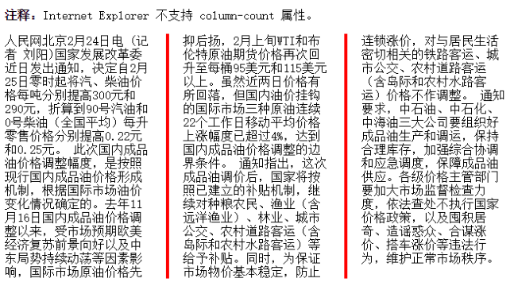

#### CSS3多列

CSS3 中新增加的多列布局(multi-column)，是传统网页中块状布局模式的有力扩充。能够轻松的让文本呈现两栏或多栏显示。

当一行文字太长时，读起来就比较费劲，人们的视点从文本的一端移到另一端、然后换到下一行的行首，如果眼球移动浮动过大，注意力就会减退，容易读不下去。所以，为了最大效率的使用大屏幕显示器，页面设计中需要限制文本的宽度，让文本按多列呈现，就像报纸上的新闻排版一样。

##### CSS3多列兼容性

- 对于一些不支持多列布局特征的浏览器，比如 IE9/IE8，会把这些属性全部忽略，这样布局就呈现出传统的单块布局。
- 为了保证浏览器最大的兼容性，在使用多列布局属性时，最好添加浏览器引擎前缀，最基本的要加上三种：
  - 谷歌浏览器的`-webkit-`
  - 火狐浏览器的`-moz-`
  - IE浏览器的`-ms-`

#### column多列布局

##### column-count

+ column-count 属性规定元素被分隔的最大列数
+ 语法：`column-count : <integer> | auto;`

```css
div {
  -moz-column-count:3; /* Firefox */
  -webkit-column-count:3; /* Safari 和 Chrome */
  column-count:3;
}
```

##### column-width

+ column-width 属性规定列最小的宽度。默认值为 auto 表示将根据 column-count 列的数量自动调整列宽
+ 语法：`column-width: auto | <length>;`

```css
div {
  -moz-column-width:150px;/* Firefox */
  -webkit-column-width:150px;/* Safari 和 Chrome */
  column-width:150px;
}
```

**columns 是 column-count 与 column-width的简写属性。**`columns: column-count column-width;`

##### column-gap

+ column-gap 属性规定列之间的间隔。
+ 语法：`column-gap : normal | <length>;`

```css
div {
  -moz-column-gap:40px;/* Firefox */
  -webkit-column-gap:40px;/* Safari 和 Chrome */
  column-gap:40px;
}
```


```html
<!DOCTYPE html>
<html>
<head>
	<meta charset="utf-8" />
	<title>多栏布局方式使用示例</title>
	<style type="text/css">
		#div1{width:600px;column-count: 3;column-width: 200px;column-gap: 100px;}
	</style>
</head>
<body>
	<div id="div1">
		
		<p>示例文字1。相对来说比较长的示例文字。示例文字。相对来说比较长的示例文字。示例文字。相对来说比较长的示例文字。示例文字。相对来说比较长的示例文字。示例文字。相对来说比较长的示例文字。示例文字。相对来说比较长的示例文字。示例文字。</p>
		<p>示例文字2。相对来说比较长的示例文字。示例文字。相对来说比较长的示例文字。示例文字。相对来说比较长的示例文字。示例文字。相对来说比较长的示例文字。示例文字。相对来说比较长的示例文字。示例文字。相对来说比较长的示例文字。示例文字。</p>
	</div>
</body>
</html>
```

##### column-rule

+ column-rule 属性设置列之间间隔线的宽度、样式和颜色规则


+ `column-rule : <length>| <style>| <color>| <transparent>;`

```css
div {
  -moz-column-rule:3px outset #ff0000;
  -webkit-column-rule:3px outset #ff0000;
  column-rule:3px outset #ff0000;
}
```

+ column-rule-width

column-rule-width 设置或检索对象的列与列之间的边框厚度。
`column-rule-width：<length> | thin | medium | thick`

```markdown
+ <length>：用长度值来定义边框的厚度。不允许负值
+ thin：定义比默认厚度细的边框。
+ medium：定义默认厚度的边框。
+ thick：定义比默认厚度粗的边框。
```

+ column-rule-style

column-rule-style 设置或检索对象的列与列之间的边框样式。

`column-rule-style ：none | hidden | dotted | dashed | solid | double | groove | ridge | inset | outset`

```markdown
+ none 定义没有规则。
+ hidden 定义隐藏规则。
+ dotted 定义点状规则。
+ dashed 定义虚线规则。
+ solid 定义实线规则。
+ double 定义双线规则。
+ groove 定义 3D grooved 规则。该效果取决于宽度和颜色值。
+ ridge 定义 3D ridged 规则。该效果取决于宽度和颜色值。
+ inset 定义 3D inset 规则。该效果取决于宽度和颜色值。
+ outset 定义 3D outset 规则。该效果取决于宽度和颜色值。
```

+ column-rule-color

column-rule-color 属性设置对象的列与列之间的边框颜色。`column-rule-color：<color>`



```css
p{
    -webkit-column-count: 3;
    -webkit-column-gap: 60px;
    -webkit-column-rule:3px outset #ff0000;
}
```

##### column-span

- column-span 属性设置或检索对象元素是否横跨所有列。
- `column-span：none | all`
  - none：不跨列
  - all：横跨所有列


```html
<!DOCTYPE html>
<html>
  <head>
      <meta charset="utf-8" />
      <title>多栏布局方式使用示例</title>
      <style type="text/css">
          div{-webkit-column-count: 3;-webkit-column-gap: 60px;-webkit-column-rule:3px dashed #ff0000;}
          h2{-webkit-column-span: all;}
      </style>
  </head>
  <body>
      <div>
          <h2>宋立洪：2016年“一带一路”建设取得八方面成果</h2>
          <p>人民网北京2月24日电（覃博雅 徐祥丽）“一带一路”智库合作联盟理事会第三次会议暨专题研讨会24日在北京召开。商务部综合司巡视员宋立洪介绍了2016年“一带一路”建设取得的八方面成果。宋立洪说，“一带一路”倡议提出三年多以来，进展顺利，取得了积极成效，国际影响越来越大。...</p>
      </div>
  </body>
</html>
```