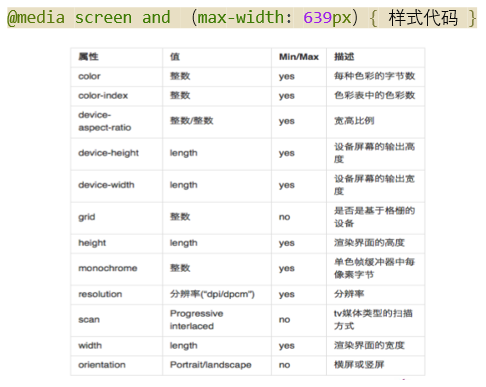
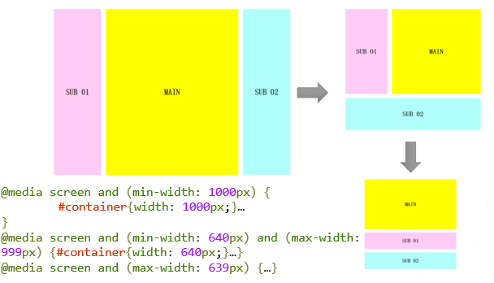
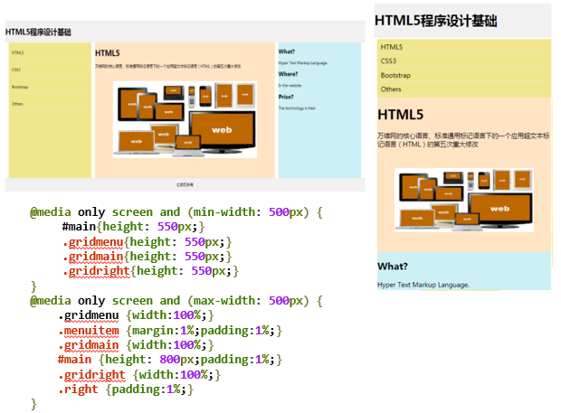

#### 自适应网页

自适应网页设计（Adaptive Web Design）指能自动识别屏幕宽度、并做出相应调整的网页设计。

- 移动端设备的屏幕比较小，宽度通常在600像素以下；
- PC端的屏幕宽度一般都在1000像素以上（目前主流宽度是1366×768），有的还达到了2000像素。
- 同样的内容，要在大小迥异的屏幕上，都呈现出满意的效果，并不是一件容易的事。

#### 响应式布局

- 响应式 Web 设计(Responsive Web Design,RWD)：根据设备环境以及用户行为调整布局。
- 对交互设计和前端实现提出了更高的要求，需要考虑清楚不同分辨率下页面的布局变化、内容的缩放等。


- 响应式Web设计的优势：开发、维护、运营成本优势；兼容性优势；操作灵活。

**实现方式**

- CSS3媒体查询：检测当前设备，来确定应用哪一个CSS样式表。
- 流式网格布局：对页面布局元素使用相对CSS比例而不是绝对大小。

#### 媒体查询

使用Media Queries模块的步骤：
1. 添加媒体查询media query表达式来指定媒体类型；
2. 针对不同的浏览器窗口尺寸编写不同的样式；
3. 浏览器根据不同的窗口尺寸来选择使用不同的样式表。

##### Media Queries的使用方法

基本语法：`@media 设备类型 and （设备特性）{ 样式代码 }`

| 设备类型       | 设备类型说明         |
| ---------- | -------------- |
| all        | 所有设备           |
| aural      | 听觉设备           |
| braille    | 点字触觉设备         |
| handled    | 便携设备，如手机、平板电脑  |
| print      | 打印预览图等         |
| projection | 投影设备           |
| screen     | 显示器、笔记本、移动端等设备 |
| tty        | 如打字机或终端等设备     |
| tv         | 电视机等设备类型       |
| embossed   | 盲文打印机          |



**实例——根据不同窗口尺寸选择使用不同的样式**



```html
<!DOCTYPE html>
<html>
<head>
	<meta charset="utf-8" />
	<title>根据不同的窗口尺寸来选择使用不同的样式的示例</title>
	<style type="text/css">
		body{margin: 20px 0;}
		#container{width: 960px;margin: auto;}
		#wrapper{width: 740px;float: left;}
		p{line-height: 600px;text-align: center;font-weight: bold;font-size: 2em;margin: 0 0 20px 0;}
		#main{width: 520px;float: right;background: yellow; /* 黄色 */}
		#sub01{width: 200px;float: left;background: #ffccf7; /* 粉色 */}
		#sub02{width: 200px;float: right;background: #b1fffc; /* 緑色 */}		
		/* 窗口宽度在1000px以上 */
		@media screen and (min-width: 1000px) {
			/* 3栏显示*/
			#container{width: 1000px;}
			#wrapper{width: 780px;float: left;}
			#main{width: 560px;float: right;}
			#sub01{width: 200px;float: left;}
			#sub02{width: 200px;float: right;}
		}
		/* 窗口宽度在640px以上、999px以下 */
		@media screen and (min-width: 640px) and (max-width: 999px) {
			/* 2栏显示 */
			#container{width: 640px;}
			#wrapper{width: 640px;float: none;}
			p{line-height: 400px;}
			#main{width: 420px;float: right;}
			#sub01{width: 200px;float: left;}
			#sub02{width: 100%;float: none;clear: both;line-height: 150px;}
		}
		/* 窗口宽度在639px以下 */
		@media screen and (max-width: 639px) {
			/* １栏显示  */
			#container{width: 100%;}
			#wrapper{width: 100%;float: none;}
			body{margin: 20px;}
			p{line-height: 300px;}
			#main{width: 100%;float: none;}
			#sub01{width: 100%;float: none;line-height: 100px;}
			#sub02{width: 100%;float: none;line-height: 100px;}
		}
	</style>	
</head>
<body>
	<div id="container">
		<div id="wrapper">
			<p id="main">MAIN</p>
			<p id="sub01">SUB 01</p>
		</div>
		<p id="sub02">SUB 02</p>
	</div>
</body>
</html>
```

**练习-响应式布局**



```html
<!DOCTYPE html>
<html>
<head>
	<style>
		.gridheader{
			background-color:#f1f1f1;
		    border:1px solid #e9e9e9;
		}
	
		.gridmenu{
			margin-left: 1%;
			width: 23%;
			float: left;
			background-color:Khaki;
		}
		.gridmain{
			margin-left: 1%;
			width: 50%;
			float: left;
			background-color:bisque;
		}
		.gridright{
			margin-left: 1%;
			width:23%;
			float: left;
			background-color:#CDF0F6;
		}
		.menuitem {
		    margin:4%;
		    margin-left:0;
		    padding:4%;
		    border-bottom:1px solid #e9e9e9;
		    cursor:pointer;
		}
		img{
			width: 80%;
			display: block;
			margin: 50px auto;
		}
		
		.gridfooter{
			text-align:center;
		    background-color:#f1f1f1;
		    border:1px solid #e9e9e9;
		}
		
		@media only screen and (min-width: 500px) {
			#main{
				height: 550px;
			}
			.gridmenu{		
				height: 550px;
			}
			.gridmain{
				height: 550px;
			}
			.gridright{
				height: 550px;
			}
		}
		@media only screen and (max-width: 500px) {
		    .gridmenu {
		        width:100%;
		    }
		    .menuitem {
		        margin:1%;
		        padding:1%;
		    }
		    .gridmain {
		        width:100%;
		    }
		    #main {
		    	height: 800px;
		        padding:1%;
		    }
		    .gridright {
		        width:100%;
		    }
		    .right {
		        padding:1%;
		    }
		}
	</style>
</head>
<body>
<div class="gridcontainer">
    <div class="gridwrapper">
    	<!--header部分-->
        <div class="gridheader">
            <div class="header">
                <h1>
                	HTML5程序设计基础
                </h1>
            </div>
        </div>
        <!--中间左侧menu部分-->
        <div id="main">
	        <div class="gridmenu">
	            <div class="menuitem">HTML5</div>
	            <div class="menuitem">CSS3</div>
	            <div class="menuitem">Bootstrap</div>
	            <div class="menuitem">Others</div>
	        </div>
	        <!--中间正文部分-->
	        <div class="gridmain">
				<h1>HTML5</h1>
				<p>万维网的核心语言、标准通用标记语言下的一个应用超文本标记语言（HTML）的第五次重大修改</p>
				
	        </div>
	        <!--中间右侧部分-->
	        <div class="gridright">
				<h2>What?</h2>
				<p>Hyper Text Markup Language.</p>
				<h2>Where?</h2>
				<p>In the website</p>
				<h2>Price?</h2>
				<p>The technology is free!</p>
	        </div>
        </div>
        <!--footer部分-->
        <div class="gridfooter">
            <div class="footer">
				<p>&copy;版权所有</p>
            </div>
        </div>
    </div>
</div>
</body>
</html>
```