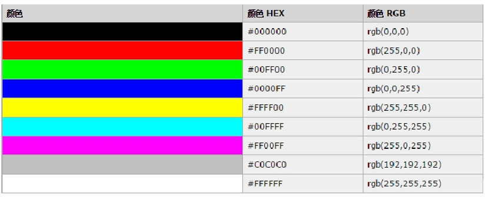
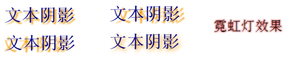
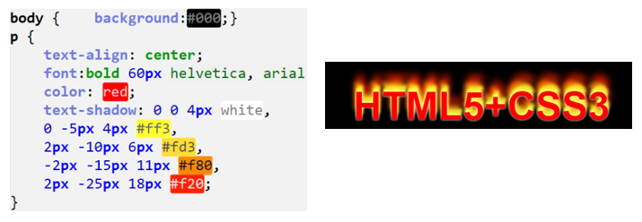
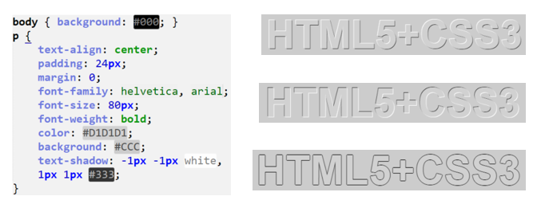
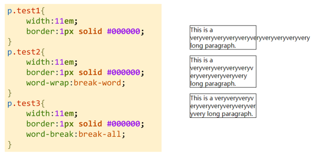
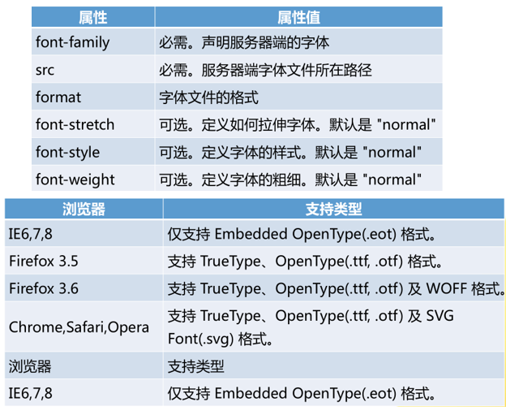
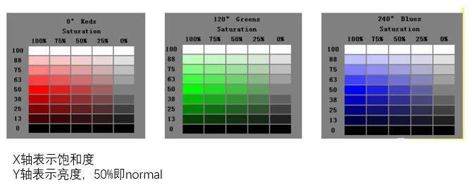
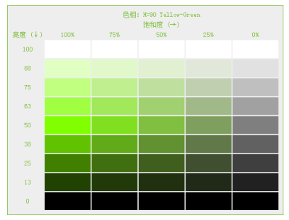

#### 文本样式

##### 文本常用的样式

文本缩进：text-indent

设置段落元素的第一行缩进方式，属性值可为绝对值（px）,也可为相对值（百分比，em）

```css
p{
  text-indent:2em;/* text-index:-3em;*/
}
```

水平对齐：text-align

影响元素的文本行的对齐方式，常用属性值有三种：`left、center、right` 

```css
p{
  text-align:left;
}
```

文本修饰：text-decoration

设置文本的修饰效果 `text-decoration：none;` a元素默认有下划线，其他元素默认值为none

|     属性值      |  效果  |
| :----------: | :--: |
|     none     |  无   |
|   overline   | 上划线  |
|  underline   | 下划线  |
| line-through | 删除线  |
|    blink     | 文本闪烁 |

文本颜色：color

设置文本的颜色 `color：#eeeeee;`



行高：line-height

- 设置行与行之间的距离。
- 属性值表示方式：– 固定值（如：line-height:36px;） – 相对值（如：line-height:1.5em;）

##### 文本阴影：text-shadow 

默认值为none，所有主流浏览器都支持该属性。

**语法**：`text-shadow : h-shadow v-shadow blur color;`

|    值     | 描述              |
| :------: | --------------- |
| h-shadow | 必需。水平阴影的位置。允许负值 |
| v-shadow | 必需。垂直阴影的位置。允许负值 |
|   blur   | 可选。模糊的距离        |
|  color   | 可选。阴影的颜色        |

可以使用 text-shadow 属性来给文字指定多个阴影，并且针对每个阴影使用不同颜色，多个阴影使用**逗号**分隔。

**练习一：修改文字阴影的位移距离、模糊半径、阴影颜色和霓虹灯效果**



```html
<!DOCTYPE html>
<html>
<head>
	<meta charset="utf-8" />
	<title>text-shadow属性的使用示例</title>
	<style type="text/css">
		body{
			color: navy;
	        font-size: 20px;
	        font-weight: bold;
	        font-family: 宋体;
		}
		#div1{text-shadow: 5px 5px 2px #F39800;}
		#div2{text-shadow: 15px 15px 3px #F39800;}
		#div3{text-shadow: -5px -5px 1px #F39800;}
		#div4{text-shadow: 5px 5px 15px #008000;}
		p{text-shadow: 0px 0px 3px red;}
	</style>
</head>
<body>
	<div id="div1">文本阴影</div>
	<div id="div2">文本阴影</div>
	<div id="div3">文本阴影</div>
	<div id="div4">文本阴影</div>
  	<!--设计阴影不发生位移，同时定义阴影模糊显示。-->
	<p>霓虹灯效果</p>
</body>
</html>
```

**练习二：定义火焰字**

借助阴影效果列表机制，可以使用阴影叠加出燃烧文字特效。



```html
<!DOCTYPE html>
<html>
	<head>
		<meta charset="utf-8" />
		<title>火焰字</title>
		<style type="text/css">
			body {background:#000;}
			p {
			    text-align: center;
			    font:bold 60px helvetica, arial, sans-serif;
			    color: red;
			    text-shadow: 0 0 4px white, 
			    0 -5px 4px #ff3,
			    2px -10px 6px #fd3,
			    -2px -15px 11px #f80,
			    2px -25px 18px #f20;
			}
		</style>
	</head>
	<body>
		<p>HTML5+CSS3</p>
	</body>
</html>
```

**练习三：定义立体文字和描边文字**

通过左上和右下各添加一个1像素错位的补色阴影，营造出淡淡的立体效果。包括立体和凹体。



```html
<!DOCTYPE html>
<html>
<head>
    <meta charset="utf-8" />
    <title>text-shadow</title>
    <style type="text/css">
        body { background: #ccc; }
        p {
            text-align: center;
            padding: 24px;
            margin: 0;
            font-family: helvetica, arial, sans-serif;
            font-size: 80px;
            font-weight: bold;
            color: #D1D1D1;
            background: #CCC;
            /*text-shadow: 1px 1px white,-1px -1px #333;*/
            /*text-shadow: -1px -1px white,1px 1px #333;*/
           text-shadow: -1px 0 #333,1px 0 #333,0 1px #333,0 -1px #333;
        }
    </style>
</head>
<body>
	<p>HTML5+CSS3</p>
</body>
</html>
```

##### 文本自动换行:word-wrap

- 可以让浏览器实现半角空格或连字符后面的换行，而且可以实现任意位置的换行。默认值为normal。
- 语法：`word-wrap: normal | break-word;`

| 值          | 描述                    |
| ---------- | --------------------- |
| normal     | 只在允许的断字点换行（浏览器保持默认处理） |
| break-word | 在长单词或URL地址内部进行换行      |

##### 文本自动换行：word-break

- 可以让浏览器实现半角空格或连字符后面的换行，而且可以实现任意位置的换行。默认值为normal。
- 语法：`word-break: normal | break-all | keep-all;`

| 值         | 描述             |
| --------- | -------------- |
| normal    | 使用浏览器默认的换行顺序   |
| break-all | 允许在单词内换行       |
| keep-all  | 只能在半角空格或连字符处换行 |



```html
<!DOCTYPE html>
<html>
<head>
	<meta charset="utf-8" />
	<style> 
		p.test1{width:11em; border:1px solid #000000;}
		p.test2{width:11em; border:1px solid #000000;word-wrap:break-word;}
		p.test3{width:11em; border:1px solid #000000;word-break:break-all;}
      /*
      word-wrap设置break-word属性会将长单词换行 但是仍然会有留白
      word-break设置break-all回达到一个好的效果，并且不会有留白
      */
	</style>
</head>
<body>
	<p class="test1">This is a veryveryveryveryveryveryveryveryveryvery long paragraph.</p>
	<p class="test2">This is a veryveryveryveryveryveryveryveryveryvery long paragraph.</p>
	<p class="test3">This is a veryveryveryveryveryveryveryveryveryvery long paragraph.</p>
</body>
</html>
```

#### 字体样式

##### 关于字体的常用属性

字体样式：font-family

`font-family:'宋体','微软雅黑',Arial,Verdana,arial,serif;`

字号：font-size

- 设置字体大小为绝对值：`font-size:20px;` 不允许用户在浏览器中改变文本大小
- 设置字体大小为相对值：font-size:2em（或font-size:200%）相对于周围的元素来设置大小.允许用户在浏览器中改变文本大小（浏览器默认的字体大小为16px）

字体风格：font-style

设置字体斜体显示：`font-style:italic`

此属性的属性值有：normal、italic、oblique

字体加粗：font-weight

- 设置字体加粗（固定值）：`font-weight:900;` 属性值取值范围为100~900
- 使用关键字加粗字体：`font-weight:bolder` 属性值：lighter、normal、bold、bolder
- 提示：400等同于normal，而700等同于bold

**在一个声明中设置所有属性**：`font-style、font-weight、font-size、font-family`

- 未设置的属性会使用默认值
- 至少要设置font-size、font-family两个属性

##### 显示服务器端字体

@font - face规则和兼容性



**实现网页中插入特殊字体的过程**

1. 获取特殊字体：http://www.dafont.com/single-malta.font
2. 获取@font-face所需字体格式：http://www.fontsquirrel.com/tools/webfont-generator
3. 应用@font-face到项目中

```css
@font-face{font-family: WebFont;src: url('webfontkit/singlemalta-webfont.ttf'); }
h1{ font-family: WebFont; }
```

#### 颜色样式

CSS3 增加了3种颜色值定义模式：RGBA颜色值、HSL颜色值和HSLA颜色值。兼容：IE9+、Firefox 3+、Chrome、Safari 以及 Opera 10+。

##### RGBA 颜色

RGBA 颜色值是 RGB 颜色值的扩展，带有一个透明度通道。

```markdown
rgba(red, green, blue, <opacity>)
# opacity 参数是介于 0.0（完全透明）与 1.0（完全不透明）的数字。
```

##### HSL 颜色

HSL色彩模式是工业界的一种颜色标准，通过对色相（Hue）、饱和度（ Saturation ）和亮度（ Lightness ）3个颜色通道的变化以及它们相互之间的叠加来获得各种颜色。

```markdown
hsl (hue, saturation, lightness)
```

- 色相（Hue）是：色盘上的度数（从 0 到 360） - 0 (或 360) 是红色，120 是绿色，240 是蓝色。
- 饱和度（ Saturation ）：表示色彩被使用了多少，或者说颜色的深浅程度、鲜艳程度。取值为0%-100%，其中0% 意味着灰度，即没有使用该颜色；100% 饱和度最高，即颜色最艳。
- 亮度（ Lightness ）：取值为0%-100%， 其中0% 是最暗，显示为黑色，100% 最亮，显示为白色。



**练习：设计颜色表。选中一个色值，利用调整颜色的饱和度与亮度比重，设计配色方案。**



```html
<!DOCTYPE html>
<html>
<head>
	<meta charset="utf-8" />
	<title></title>
	<style type="text/css">
		table {
		    border:solid 1px hsl(90,50%,50%);
		    background:#eee;
		    padding:6px;
		}
		th {
		    color:hsl(90,50%,50%);
		    font-size:12px;
		    font-weight:normal;   
		}
		td {
		    width:80px;
		    height:30px;   
		}
		tr:nth-child(4) td:nth-of-type(1) { background:hsl(90,100%,100%);}
		tr:nth-child(4) td:nth-of-type(2) { background:hsl(90,75%,100%);}
		tr:nth-child(4) td:nth-of-type(3) { background:hsl(90,50%,100%);}
		tr:nth-child(4) td:nth-of-type(4) { background:hsl(90,25%,100%);}
		tr:nth-child(4) td:nth-of-type(5) { background:hsl(90,0%,100%);}
		
		tr:nth-child(5) td:nth-of-type(1) { background:hsl(90,100%,88%);}
		tr:nth-child(5) td:nth-of-type(2) { background:hsl(90,75%,88%);}
		tr:nth-child(5) td:nth-of-type(3) { background:hsl(90,50%,88%);}
		tr:nth-child(5) td:nth-of-type(4) { background:hsl(90,25%,88%);}
		tr:nth-child(5) td:nth-of-type(5) { background:hsl(90,0%,88%);}
		
		tr:nth-child(6) td:nth-of-type(1) { background:hsl(90,100%,75%);}
		tr:nth-child(6) td:nth-of-type(2) { background:hsl(90,75%,75%);}
		tr:nth-child(6) td:nth-of-type(3) { background:hsl(90,50%,75%);}
		tr:nth-child(6) td:nth-of-type(4) { background:hsl(90,25%,75%);}
		tr:nth-child(6) td:nth-of-type(5) { background:hsl(90,0%,75%);}
		
		tr:nth-child(7) td:nth-of-type(1) { background:hsl(90,100%,63%);}
		tr:nth-child(7) td:nth-of-type(2) { background:hsl(90,75%,63%);}
		tr:nth-child(7) td:nth-of-type(3) { background:hsl(90,50%,63%);}
		tr:nth-child(7) td:nth-of-type(4) { background:hsl(90,25%,63%);}
		tr:nth-child(7) td:nth-of-type(5) { background:hsl(90,0%,63%);}
		
		tr:nth-child(8) td:nth-of-type(1) { background:hsl(90,100%,50%);}
		tr:nth-child(8) td:nth-of-type(2) { background:hsl(90,75%,50%);}
		tr:nth-child(8) td:nth-of-type(3) { background:hsl(90,50%,50%);}
		tr:nth-child(8) td:nth-of-type(4) { background:hsl(90,25%,50%);}
		tr:nth-child(8) td:nth-of-type(5) { background:hsl(90,0%,50%);}
		
		tr:nth-child(9) td:nth-of-type(1) { background:hsl(90,100%,38%);}
		tr:nth-child(9) td:nth-of-type(2) { background:hsl(90,75%,38%);}
		tr:nth-child(9) td:nth-of-type(3) { background:hsl(90,50%,38%);}
		tr:nth-child(9) td:nth-of-type(4) { background:hsl(90,25%,38%);}
		tr:nth-child(9) td:nth-of-type(5) { background:hsl(90,0%,38%);}
		
		tr:nth-child(10) td:nth-of-type(1) { background:hsl(90,100%,25%);}
		tr:nth-child(10) td:nth-of-type(2) { background:hsl(90,75%,25%);}
		tr:nth-child(10) td:nth-of-type(3) { background:hsl(90,50%,25%);}
		tr:nth-child(10) td:nth-of-type(4) { background:hsl(90,25%,25%);}
		tr:nth-child(10) td:nth-of-type(5) { background:hsl(90,0%,25%);}
		
		tr:nth-child(11) td:nth-of-type(1) { background:hsl(90,100%,13%);}
		tr:nth-child(11) td:nth-of-type(2) { background:hsl(90,75%,13%);}
		tr:nth-child(11) td:nth-of-type(3) { background:hsl(90,50%,13%);}
		tr:nth-child(11) td:nth-of-type(4) { background:hsl(90,25%,13%);}
		tr:nth-child(11) td:nth-of-type(5) { background:hsl(90,0%,13%);}
		
		tr:nth-child(12) td:nth-of-type(1) { background:hsl(90,100%,0%);}
		tr:nth-child(12) td:nth-of-type(2) { background:hsl(90,75%,0%);}
		tr:nth-child(12) td:nth-of-type(3) { background:hsl(90,50%,0%);}
		tr:nth-child(12) td:nth-of-type(4) { background:hsl(90,25%,0%);}
		tr:nth-child(12) td:nth-of-type(5) { background:hsl(90,0%,0%);}
	</style>
</head>

<body>
<table class="hslexample">
    <tbody>
        <tr>
            <th>&nbsp;</th>
            <th colspan="5">色相：H=90 Yellow-Green</th>
        </tr>
        <tr>
            <th>&nbsp;</th>
            <th colspan="5">饱和度 (&rarr;)</th>
        </tr>
        <tr>
            <th>亮度 (&darr;)</th>
            <th>100% </th>
            <th>75% </th>
            <th>50% </th>
            <th>25% </th>
            <th>0% </th>
        </tr>
        <tr>
            <th>100 </th>
            <td>&nbsp;</td>
            <td>&nbsp;</td>
            <td>&nbsp;</td>
            <td>&nbsp;</td>
            <td>&nbsp;</td>
        </tr>
        <tr>
            <th>88 </th>
            <td>&nbsp;</td>
            <td>&nbsp;</td>
            <td>&nbsp;</td>
            <td>&nbsp;</td>
            <td>&nbsp;</td>
        </tr>
        <tr>
            <th>75 </th>
            <td>&nbsp;</td>
            <td>&nbsp;</td>
            <td>&nbsp;</td>
            <td>&nbsp;</td>
            <td>&nbsp;</td>
        </tr>
        <tr>
            <th>63 </th>
            <td>&nbsp;</td>
            <td>&nbsp;</td>
            <td>&nbsp;</td>
            <td>&nbsp;</td>
            <td>&nbsp;</td>
        </tr>
        <tr>
            <th>50 </th>
            <td>&nbsp;</td>
            <td>&nbsp;</td>
            <td>&nbsp;</td>
            <td>&nbsp;</td>
            <td>&nbsp;</td>
        </tr>
        <tr>
            <th>38 </th>
            <td>&nbsp;</td>
            <td>&nbsp;</td>
            <td>&nbsp;</td>
            <td>&nbsp;</td>
            <td>&nbsp;</td>
        </tr>
        <tr>
            <th>25 </th>
            <td>&nbsp;</td>
            <td>&nbsp;</td>
            <td>&nbsp;</td>
            <td>&nbsp;</td>
            <td>&nbsp;</td>
        </tr>
        <tr>
            <th>13 </th>
            <td>&nbsp;</td>
            <td>&nbsp;</td>
            <td>&nbsp;</td>
            <td>&nbsp;</td>
            <td>&nbsp;</td>
        </tr>
        <tr>
            <th>0 </th>
            <td>&nbsp;</td>
            <td>&nbsp;</td>
            <td>&nbsp;</td>
            <td>&nbsp;</td>
            <td>&nbsp;</td>
        </tr>
    </tbody>
</table>
</body>
</html>
```

##### HSLA 颜色

HSLA 颜色值是 HSL 颜色值的扩展，带有一个透明度通道

```markdown
hsla(hue, saturation, lightness, opacity)
# opacity参数是介于 0.0（完全透明）与 1.0（完全不透明）的数字。
```