#### 渐变效果

- 网页中的渐变效果包括渐变背景、渐变导航、渐变按钮等
- CSS3 渐变分类：线性渐变、径向渐变
- CSS3 渐变优点：
  - 代替使用图像来实现效果，可以减少下载的时间和宽带的使用。
  - 由浏览器生成，在放大时看起来效果更好

##### 线性渐变

- 语法：`background: linear-gradient(direction, color-stop1, color-stop2, ...);`
- 在一条直线上进行颜色渐变，渐变线由包含渐变图形的容器的中心点和一个角度来定义的
- `linear-gradient()` 函数创建一个没有内在尺寸的，表示颜色线性渐变的 `<image>` 图像；它既不具有固有的或首选的尺寸，也不具有比率。它的具体尺寸将与其适用的元素尺寸匹配

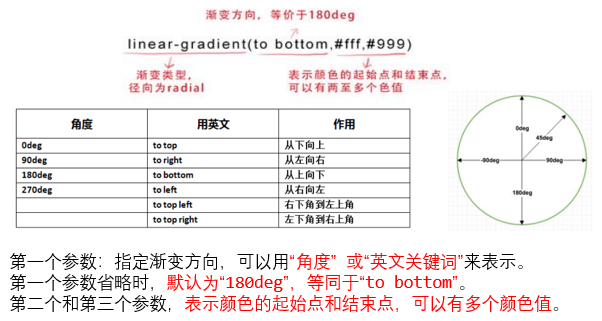

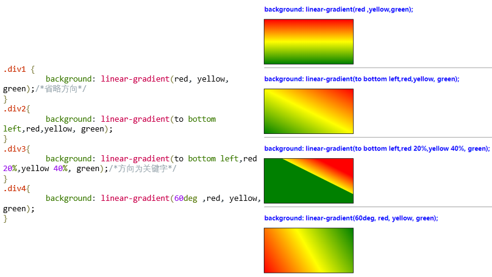

+ `repeating-linear-gradient()` 函数用于重复线性渐变：

```css
background: repeating-linear-gradient(red, yellow 10%, green 20%);
```

##### 练习

+ 切角效果把一个透明色标放在切角处，然后在相同的位置设置另一个色标


+ 渐变按钮

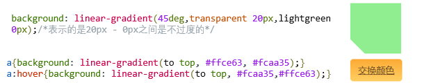

```html
<!DOCTYPE html>
<html>
<head>
    <meta charset="UTF-8">
    <title>切脚效果</title>
    <style>
        .div1{
            height: 100px;
            width: 100px;
            background: linear-gradient(45deg,transparent 20px,lightgreen 0px);
            /*表示的是20px - 0px之间是不过度的*/
           /*background:linear-gradient(to top right,white 20%,lightgreen)*/
        }   
        a{
            padding: 10px 15px;
            border-radius: 6px;
            color: #623f1d;
            font-size: 18px ;
            background: linear-gradient(to top, #ffce63, #fcaa35);
        }
        a:hover{
            background: linear-gradient(to top, #fcaa35,#ffce63);
        }
    </style>
</head>
<body>
	<div class="div1"></div>
	<br/>
	<a href="#">交换颜色</a>
</body>
</html>
```

##### 径向渐变

+ 语法：`background: radial-gradient (shape at position, color1 stop,color2 stop,...)`


+ 是一种从起点到终点颜色从内到外进行圆形渐变（从中间向外拉，像圆一样）。

`shape`：关键字

1. `circle` —— 定义径向渐变为 "圆形"
2. `ellipse` —— 定义径向渐变为 "椭圆形"

`position` ：关键字或长度值。其中长度值可以是 **px(可负)或百分比 30%(可负)**

+ 在径向渐变中没有设置位置时，其默认颜色为均匀间隔，设置了渐变位置就会按照渐变位置去渐变。

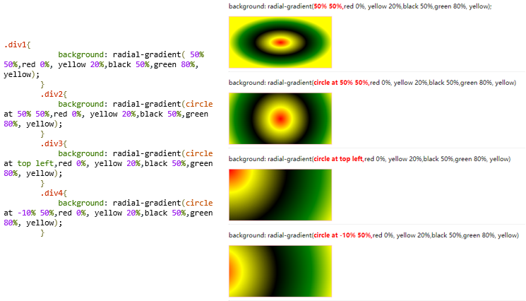

#### transform

在 CSS3 中提供了 transform 和 transform-origin 两个用于实现 2D 变换的属性。

- transform 属性用于实现平移、缩放、旋转和倾斜等 2D 变换。
- transform-origin 属性则是用于设置变换的中心点的。

transform 属性向元素应用 2D 或 3D 转换。通过转换能够对元素进行旋转、缩放、移动、倾斜或拉伸。
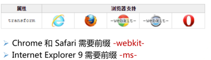

##### 移动—translate()方法

translate( ) 方法能够重新定位元素的坐标。

+ translateX(x)：元素仅在水平方向移动（X轴移动）


+ translateY(y)：元素仅在垂直方向移动（Y轴移动）


+ translate(x , y)：元素在水平方向和垂直方向同时移动

> 说明：
> 在实际开发中需要根据情况添加各浏览器厂商的前缀。Firefox浏览器添加-moz-前缀；IE浏览器添加-ms-前缀；Opera浏览器添加-o-前缀；Chrome浏览器添加-webkit-前缀。

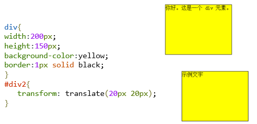

**练习：给导航菜单添加定位功能，使导航菜单更富动感。**

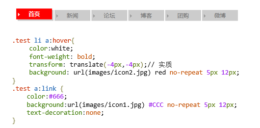

```html
<!DOCTYPE html>
<html>
<head>
	<meta charset="utf-8" />
	<title>translate()函数</title>
	<style type="text/css">
		.test ul { list-style:none; }
		.test li {
		    float:left;
		    width:100px;
		    background:#CCC;
		    margin-left:3px;
		    line-height:30px;
		}
		.test a {
		    display:block;
		    text-align:center;
		    height:30px;
		}
		.test li a:hover{
			color:white;
			font-weight: bold;
			transform: translate(-4px,-4px);
			background: url(images/icon2.jpg) red no-repeat 5px 12px;
		}
		.test a:link {
		    color:#666;
		    background:url(images/icon1.jpg) #CCC no-repeat 5px 12px;
		    text-decoration:none;
		}
		.test a:visited {
		    color:#666;
		    text-decoration:underline;
		}
	</style>
</head>

<body>
<div class="test">
    <ul>
        <li><a href="1">首页</a></li>
        <li><a href="2">新闻</a></li>
        <li><a href="3">论坛</a></li>
        <li><a href="4">博客</a></li>
        <li><a href="5">团购</a></li>
        <li><a href="6">微博</a></li>
    </ul>
</div>
</body>
</html>
```

##### 旋转—rotate() 方法

rotate( ) 方法能够相对中心原点旋转指定的元素。

+ transform: rotate(angle)


+ 正角度为顺时针旋转元素


+ 负角度为逆时针旋转元素

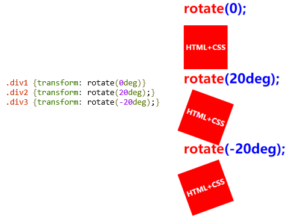

##### 缩放—scale() 方法

scale( ) 方法能够实现文字或图像根据中心原点进行缩放。

+ scaleX(x)：元素仅水平方向缩放（X轴缩放）；


+ scaleY(y)：元素仅垂直方向缩放（Y轴缩放）；


+ scale(x，y)：元素水平方向和垂直方向同时缩放；


+ 参数 x，y 为自然数数值（可以为正、负、小数）

> 说明：
> 绝对值大于1，代表放大；绝对值小于1，代表缩小；
> 当参数值为1时，表示不进行缩放；
> 当值为负数时，对象反转。
>
> 注意：当使用scaleX(num)或scaleY(num)函数时，实现的是非等比例缩放

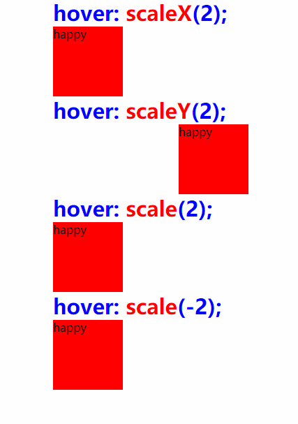

```css
.div1:hover{transform: scaleX(2);}
.div2:hover{transform: scaleY(2);}
.div3:hover{transform: scale(2);}
.div4:hover{transform: scale(-2);}
```

##### 倾斜—skew()方法

skew( ) 方法能够倾斜指定的元素。

+ skewX(x)：元素仅水平方向倾斜（X轴倾斜）；


+ skewY(y)：元素仅垂直方向倾斜（Y轴倾斜）；


+ skew(x，y)：元素水平方向和垂直方向同时倾斜；如果第二个参数为空，则默认为0，参数为负表示向相反方向倾斜。

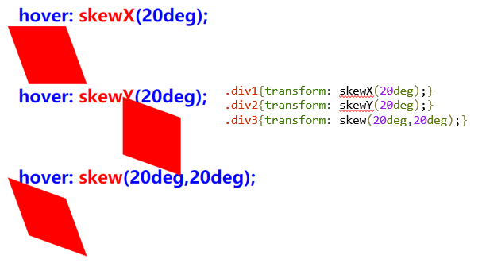

##### 3D变形功能

CSS3 允许使用 3D 转换来实现元素在X轴、Y轴、Z轴方向上的变形处理

- rotateX(angle)：元素围绕其 X 轴以给定的度数进行旋转。
- rotateY(angle)：元素围绕其 Y 轴以给定的度数进行旋转。
- rotateZ(angle)：元素围绕其 Z 轴以给定的度数进行旋转。

**3D旋转变形实例：**
页面中显示一个div元素以及一个“绕X轴旋转”按钮、一个“绕Y轴旋转”按钮及一个“绕Z轴旋转”按钮。用户单击各按钮时脚本程序通过修改div元素的transform属性值中rotateX、rotateY、rotateZ方法的参数值使div元素分别围绕X、Y、Z轴旋转180°。

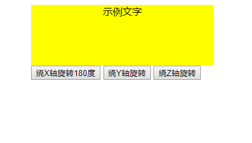

```html
<!DOCTYPE html>
<html>
<head>
	<meta charset="utf-8" />
	<title>3D旋转变形方法的使用示例</title>
	<style type="text/css">
		div{
			width: 300px;
			height:100px;
			background-color: yellow;
			text-align: center;
		}
	</style>
</head>
<body>
	<div id="div">示例文字</div>
	<input type="button" value="绕X轴旋转180度" onclick="rotateX()" />
	<input type="button" value="绕Y轴旋转" onclick="rotateY()" />
	<input type="button" value="绕Z轴旋转" onclick="rotateZ()" />
	<script>
		var n,rotINT,rotXINT,rotYINT,rotZINT;
		var div=document.getElementById("div");
		 
		function rotateX()
		{
		    n=0;
		    clearInterval(rotXINT);
		    rotXINT=setInterval("startXRotate()",10);
		}
		function startXRotate()
		{
		    n=n+1;
		    div.style.transform="rotateX(" + n + "deg)";
		    if (n==180)
		    {
		        clearInterval(rotXINT);
			n=0;
		    }
		}
		function rotateY()
		{
		    n=0;
		    clearInterval(rotYINT);
		    rotYINT=setInterval("startYRotate()",10);
		}
		function startYRotate()
		{
		    n=n+1;
		    div.style.transform="rotateY(" + n + "deg)";
		    if (n==180)
		    {
		        clearInterval(rotYINT);
			n=0;
		    }
		}
		function rotateZ()
		{
		    n=0;
		    clearInterval(rotZINT);
		    rotZINT=setInterval("startZRotate()",10);
		}
		function startZRotate()
		{
		    n=n+1;
		    div.style.transform="rotateZ(" + n + "deg)";
		    if (n==180)
		    {
		        clearInterval(rotZINT);
			n=0;
		    }
		}
	</script>
</body>
</html>
```

#### transform-origin

transform-origin 属性更改变换的基点位置。`transform-origin: x-axis y-axis;`

+ 默认情况下，元素基点位置为元素的中心点，即X 轴和 Y 轴的50% 处。


+ CSS3 变形进行的位移、缩放、旋转、倾斜都是以元素的基点进行变形。


+ 默认值为 center center ，等价于 50% 50%

|   值    | 描述                                       |
| :----: | ---------------------------------------- |
| x-axis | 指定原点被置于 X 轴的何处。可能的值：left \| center \| right \| length \| % |
| y-axis | 指定原点被置于 Y 轴的何处。可能的值：top \| center \| bottom \| length \| % |

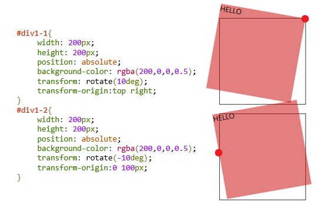

#### 多重变形

对同一元素可添加多种变形效果。元素经过移动后旋转并放大
`transform: translate(150px,200px) rotate(120deg) scale(1.5,1.5);`

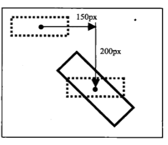

#### 案例实战

- 不使用JS，综合运用CSS阴影、透明效果、变形动画，设计涂鸦墙。使用移动、旋转、缩放等函数控制元素创建丰富、轻量级的界面应用。
- 默认状态下图片被随意显示在墙面上，鼠标经过图片时会竖直摆放，并被放大显示。

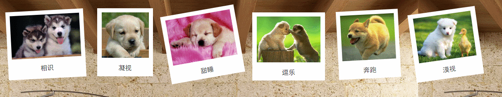

```html
<!DOCTYPE html>
<html>
	<head>
		<meta charset="UTF-8">
		<title>照片墙</title>
		<style>
			*{padding: 0px;margin: 0px;}
			body{background-image:url(images/bg3.JPG);}
			div{float: left;background-color: white;height: 155px;margin-left:30px;margin-top:30px;padding:5px;text-align: center;}
			div img{margin-top:5px;}
			div:nth-child(1){width:178px;transform: rotate(-3deg);}
			div:nth-child(1):hover{transform: rotate(0deg) scale(1.2)}
			div:nth-child(1) img{width:168px;height: 105px;}
			div:nth-child(2){width: 125px;transform: translateY(-5px)}
			div:nth-child(2):hover{transform: rotate(0deg) scale(1.2)}
			div:nth-child(2) img{width:114px;height: 110px;}
			div:nth-child(3){width: 170px;transform: rotate(-10deg);}
			div:nth-child(3):hover{transform: rotate(0deg) scale(1.2)}
			div:nth-child(3) img{width:158px;height: 111px;}
			div:nth-child(4){width: 166px;transform: translateY(5px)}
			div:nth-child(4):hover{transform: rotate(0deg) scale(1.2)}
			div:nth-child(4) img{width:154px;height: 111px;}
			div:nth-child(5){width: 140px;transform: rotate(-3deg);}
			div:nth-child(5):hover{transform: rotate(0deg) scale(1.2)}
			div:nth-child(5) img{width:130px;height: 110px;}
			div:nth-child(6){width: 154px;transform: rotate(-8deg);}
			div:nth-child(6):hover{transform: rotate(0deg) scale(1.2)}
			div:nth-child(6) img{width:140px;height: 109px;}
			span{color:#333;height: 30px;display: block;line-height: 30px;font-size: 16px;font-family: "黑体";margin-top:5px;}
		</style>
	</head>
	<body>
		<div><span>相识</span></img></div>
		<div><span>凝视</span></img></div>
		<div><span>甜睡</span></img></div>
		<div><span>逗乐</span></img></div>
		<div><span>奔跑</span></img></div>
		<div><span>漠视</span></img></div>
	</body>
</html>
```

