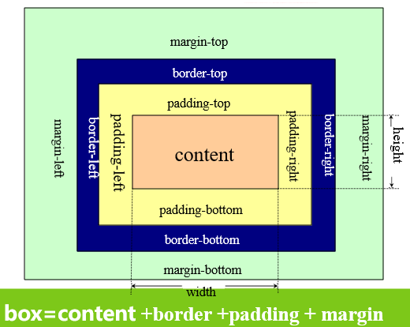

#### 区块

根据HTML元素的显示特征，可分为：

+ 块级元素（blocklevelelement）：元素在显示时会独占一行，并同时具有宽、高、内外边距特征。


+ 行内元素（inlineelement）在显示时通常不会以新行开始，横向排列，到最右端自动折行。

常见的块级元素：

```txt
p–段落
H1~h6–标题
ul、ol、dl、li–列表、列表项
table–表格
form–交互表单
```

常见的行内元素：

```txt
a–链接
img–图片
input–输入框,
select–项目选择
font–字体设定
b–粗体
i–斜体
strong–粗体强调
```

##### 容器元素

`<div></div>`

+ 块级元素，作为内容或其他元素的容器
+ 控制元素的大小、边框、位置等，控制内部元素和内容的样式

`<span></span>`

+ 行内元素（内联元素）作为内容或其他元素的容器


+ 控制内部元素和内容的样式

div和span元素最大的特点是默认都没有对元素内的对象进行任何格式化渲染。主要用于应用样式表。两者最明显的区别在于div是块元素，而span是行内元素(也译作内联元素)。

##### 区块样式

display:用于定义元素生成的显示框类型

+ none:元素不会被显示。


+ block:元素将显示为块级元素。


+ inline:默认，元素会被显示为行内元素。


+ inline-block:行内块元素。


+ inherit：从父元素继承display属性的值

#### 盒子模型

Web中的盒子：一个矩形区域，内容包裹在盒子中。盒子的堆叠与嵌套形成整个页面的内容排布。

每个盒子模型特征：大小、边框、内边距、外边距


##### 盒模型属性



+ 宽、高（width、height）


+ 内边距（填充距）（padding）：用于控制内容部分与边框的间距

```css
/*
- padding-top  上边距
- padding-right  右边距
- padding-bottom  下边距
- padding-left  左边距
*/
padding:上 右 下 左(px);
padding: 上下 左右(px);
```

+ 外边距（margin）：用于控制盒子之间的间距

```css
/*
- margin-top  上边距
- margin-right  右边距
- margin-bottom  下边距
- margin-left  左边距
*/
margin:上 右 下 左(px);
margin: 上下 左右(px);
```

+ 浮动（float）

设置浮动：  `float：属性值`


```markdown
1. 只有左右浮动，没有上下浮动。
2. 浮动不会对该元素的上一个兄弟元素有任何影响
3. 下一个兄弟元素如果也设置了同一方向的float，则会紧随该元素之后显示。
4. 如果父元素宽度不够，浮动元素会另起一行显示。
5. 父元素如果浮动，那么为了保持一致，子元素也需要浮动。
6. 元素设置float之后，它会脱离普通流不再占据原来那层的空间，还会覆盖下一层的元素。
7. 浮动之后，该元素的之后的元素会向上补位。
8. 如果该元素的下一个兄弟元素中有内联元素（通常是文字），则会围绕该元素显示。
9. 该元素将变为块级元素，相当于给该元素设置了display:block。
```

+ 清除浮动（clear）

清除浮动：`clear：属性值`

1. both:清除全部浮动
2. left:清除float：left的浮动
3. right:清除float：right的浮动

#### 定位

position属性规定元素的定位类型。

| 值        | 描述                                    |
| -------- | ------------------------------------- |
| absolute | 生成绝对定位的元素，相对于static定位以外的第一  个父元素进行定位。 |
| fixed    | 生成绝对定位的元素，相对于浏览器窗口进行定位。               |
| relative | 生成相对定位的元素，相对于其正常位置进行定位。               |
| static   | 默认值。没有定位，元素出现在正常的流中。                  |
| inherit  | 从父元素继承position属性的值。                   |

##### 绝对定位

`position : absolute`

位置属性：

+ left： 定位元素左边界与其父元素左边界之间的偏移


+ right：定位元素右边界与其父元素右边界之间的偏移


+ top：定位元素上边界与其父元素上边界之间的偏移


+ bottom：定位元素下边界与其父元素下边界之间的偏移


- 如果父级元素未设置position属性，则以浏览器窗口左上角为起始位置。
- 如果父级元素设置了position属性（absolute或者relative），则以父级元素左上角为起始位置。

+ 任何元素都可以定位，不过绝对或固定元素会生成一个块级框，而不论该元素本身是什么类型。

> 特别注意：绝对定位与float浮动不能同时使用

##### 相对定位

`position : relative`

+ 相对定位元素会相对于它在正常流中的默认位置偏移。与父元素无关

位置属性：

+ left：定位元素左边界与其原位置左边界之间的偏移


+ right：定位元素右边界与其原位置右边界之间的偏移


+ top：定位元素上边界与其原位置上边界之间的偏移


+ bottom：定位元素下边界与其原位置下边界之间的偏移

##### 层次

顺序堆叠属性：z-index：auto/number/inherit

- z-index属性设置元素的堆叠顺序。

- z-index仅能在`定位元素`上奏效（`position:realitive | absolute | fixed`）

- 元素可拥有负的z-index属性值

- 该属性设置一个定位元素沿z 轴的位置，z 轴定义为垂直延伸到显示区的轴。如果为正数，则离用户更近，为负数则表示离用户更远。


##### 溢出

overflow   ——定义溢出元素内容区的内容如何处理

| 值       | 描述                          |
| ------- | --------------------------- |
| visible | 默认值。内容不会被修剪，会呈现在元素框之外       |
| hidden  | 内容会被修剪，并且其余内容是不可见的          |
| scroll  | 内容会被修剪，但是浏览器会显示滚动条以便查看其余的内容 |
| auto    | 如果内容被修剪，浏览器会显示滚动条以便查看其余的内容  |
| inherit | 规定应该从父元素继承overflow属性的值      |

+ 父元素设置的高度或宽度小于子元素时，使父元素出现相应滚动条或隐藏子元素超出部分内容。


+ 父元素不设高度并且子元素浮动时，使父元素高度自动适应子元素高度。

剪裁

clip属性剪裁绝对定位元素。`clip：auto/shape/inherit`

| 值       | 描述                                       |
| ------- | ---------------------------------------- |
| shape   | 设置元素的形状。  唯一合法的形状值是：rect(top,right,bottom,left) |
| auto    | 默认值。不应用任何剪裁。                             |
| inherit | 规定应该从父元素继承clip属性的值。                      |

`clip:rect(<top>,<right>,<bottom>,<left>);`


##### float和position的区别和共同点

float和position相似点：

+ 都是将元素浮动起来


+ 一旦设置元素就脱离文档流了，如果父元素没有设置高度则会高度“塌陷”。

float和position不同点：

+ position与top、left等配合使用


+ float位置调整通过margin、padding等实现


+ **overflow和clear对position无效**


+ 布局通常使用float，而不是position