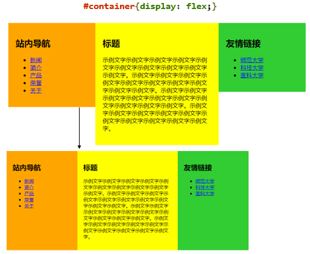
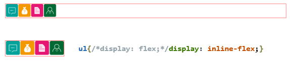
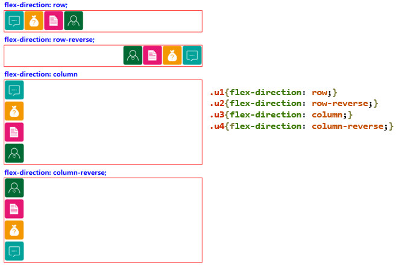
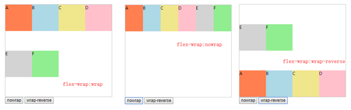
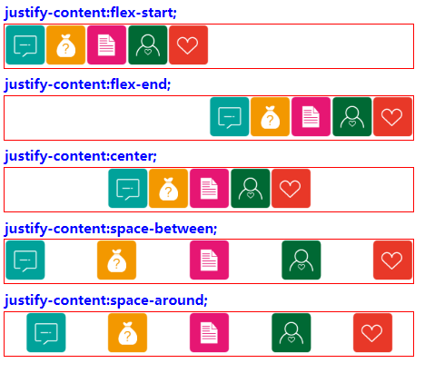
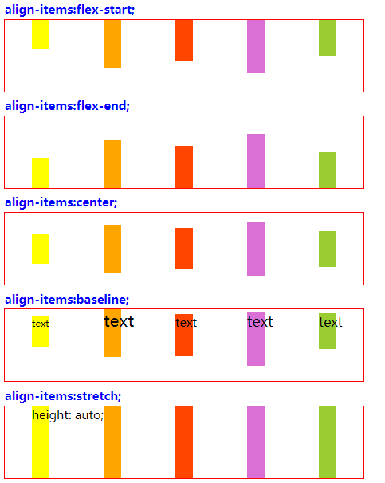
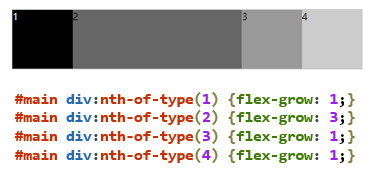
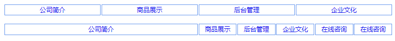

#### 盒的相关样式

布局用来确定页面上不同组件和元素的尺寸和位置。

+ 传统解决方案：基于盒状模型，依赖 display 属性 + position 属性 + float 属性。


+ 特殊布局不方便，比如，垂直居中（`line-height:height`），均匀分布（`text-align:cenetr, margin:0px auto`）。

随着响应式用户界面的流行，Web 应用要求适配不同的设备尺寸和浏览器分辨率，需要根据窗口尺寸来调整布局，从而改变组件的尺寸和位置，以达到最佳的显示效果。

##### 弹性盒布局

在 CSS3 中引入了新的盒模型 —— 弹性盒模型，该模型决定一个盒子在其他盒子中的分布方式以及如何处理可用的空间。

+ W3C 2009年第1次草案：display:box;


+ W3C 2011年第2次草案：display:flexbox | inline-flexbox;


+ W3C 2012年第5次草案及以后的推荐标准：**display:flex** | inline-flex;

简便、完整、响应式地实现各种页面布局。已得到了所有浏览器的支持



+ Flex 是 Flexible Box 的缩写，意为“弹性布局" ，用来为盒状模型提供最大的灵活性。


+ 容器会根据布局的需要，调整其中包含的条目的尺寸和顺序来最好地填充所有可用的空间。当容器的尺寸由于屏幕大小或窗口尺寸发生变化时，其中包含的条目也会被动态地调整。
  + 当容器尺寸变大时，其中包含的条目会被拉伸以占满多余的空白空间；
  + 当容器尺寸变小时，条目会被缩小以防止超出容器的范围。


+ 弹性盒布局是**与方向无关的**。在传统布局中，block 布局是把块在垂直方向从上到下依次排列的； inline 布局则是在水平方向来排列。弹性盒布局没有这样内在的方向限制，可以由开发人员自由操作。


+ 任何一个容器都可以指定为弹性盒子。设为 Flex 布局以后，**子元素的 float、clear 属性将失效**。
  + display: flex; —— 块级弹性盒子
  + display: inline-flex; —— 行块级弹性盒子



```html
<!DOCTYPE html>
<html>
    <head lang="en">
        <meta charset="UTF-8">
        <title>弹性盒子</title>
        <style>
            *{padding:0;margin:0;}
            body{padding: 20px;}
            ul{/*display: flex;*/display: inline-flex;list-style: none;outline: 1px solid red;}
        </style>
    </head>
    <body>
        <ul>
            <li></li>
            <li></li>
            <li></li>
            <li></li>
        </ul>
    </body>
</html>
```

#### 弹性盒模型

##### 基本概念

- Flex 容器（flex Container）：指定为 Flex 布局的元素，称为Flex 容器，简称“容器”。
- Flex 项目（flex item）：弹性盒子的所有子元素自动成为容器成员，称为 Flex 项目，简称“项目”。
- 容器默认存在两根轴：水平的主轴和垂直的交叉轴。

在上述例子中，三个div盒子就是flex项目，而最外面的container就是flex容器

##### 容器属性

+ flex-direction —— 定义子元素在主轴的排列方式


+ flex-wrap —— 定义子元素在一条轴线排不下时如何换行


+ justify-content —— 定义子元素在主轴的对齐方式


+ align-items —— 定义子元素在纵轴上的对齐方式

flex-direction 属性 —— 规定 flex 项目沿着**主轴的排列方向**

```markdown
# flex-direction: row | row-reverse | column | column-reverse;(默认为row)
+ row：主轴为水平方向，起点在左端。
+ row-reverse：主轴为水平方向，起点在右端。
+ column：主轴为垂直方向，起点在上沿。
+ column-reverse：主轴为垂直方向，起点在下沿。
```



flex-wrap 属性 —— 规定 flex 容器是**单行或者多行**，同时横轴的方向决定了新行堆叠的方向

```markdown
# flex-wrap: nowrap | wrap | wrap-reverse; 默认为nowrap
+ nowrap ：默认值。规定灵活的项目不拆行或不拆列。
+ wrap ： 规定灵活的项目在必要的时候拆行或拆列。
+ wrap-reverse ： 规定项目在必要的时候以相反的顺序拆行或拆列。
```



justify-content 属性 —— 规定项目**在主轴上的对齐方式**。

```markdown
# justify-content: flex-start | flex-end | center | space-between | space-around;
+ flex-start：左对齐(默认方式)
+ flex-end ：右对齐
+ center：居中
+ space-between：两端对齐，项目之间的间隔都相等。
+ space-around：每个项目两侧的间隔相等。故项目之间的间隔比项目与边框的间隔大一倍。
```



align-items 属性 —— 规定项目了**在纵轴上的对齐方式**。

```markdown
# align-items: flex-start | flex-end | center | baseline | stretch;
+ flex-start：元素位于容器的开头。
+ flex-end ：元素位于容器的结尾。
+ center：弹性盒子元素在该行的侧轴（纵轴）上居中放置。
+ baseline：项目的第一行文字的基线对齐。
+ stretch：元素被拉伸以适应容器。如果项目未设置高度或设为auto，将占满整个容器的高度。(默认)
```



##### 项目属性

+ flex-grow ——定义项目的放大比例


+ flex-shrink ——定义了项目的缩小比例


+ flex-basis —— 定义了在分配多余空间之前，项目占据的主轴空间


+ flex —— flex-grow, flex-shrink 和 flex-basis的简写，默认值为0 1 auto，后两个属性可选

flex-grow 属性 —— 定义项目的**放大比例**，默认为0，即如果存在剩余空间，也不放大。

```markdown
# flex-grow: number;
+ 如果所有项目的flex-grow属性都为1，则它们将等分剩余空间。
+ 如果一个项目的flex-grow属性为2，其他项目都为1，则前者占据的剩余空间将比其他项多一倍。
```



flex-shrink 属性 ——定义了项目的**缩小**比例，默认为1，即如果空间不足，该项目将缩小。

```markdown
# flex-shrink: number;
+ flex 元素仅在默认宽度之和大于容器的时候才会发生收缩。
+ 如所有项目的 flex-shrink 属性都为1，当空间不足时，将等比例缩小。如一个项目的 flex-shrink 属性为0，其他项目都为1，则空间不足时，前者不缩小。
```

flex-basis 属性 —— 设置弹性盒**伸缩基准值**。

```markdown
# flex-basis: number | auto;
+ number：长度单位或者百分比，规定灵活项目的初始长度。
+ auto：默认值。长度等于灵活项目的长度。如果该项目未指定长度，则长度将根据内容决定。
```

flex 属性 —— flex-grow, flex-shrink 和 flex-basis的简写，默认值为0 1 auto。后两个属性可选。

+ flex-basis: number | auto ;


+ 该属性有两个快捷值：auto (1 1 auto) 和 none (0 0 auto)。


+ flex: 1 ; 所有项目等分剩余空间。

##### 练习

+ 基本网格布局（平均分布）


+ 百分比布局（某个网格的宽度为固定的百分比，其余网格平均分配剩余的空间）



```html
<!DOCTYPE html>
<html>
<head>
    <meta charset="UTF-8">
    <title>flex</title>
    <style type="text/css">
        * {padding: 0;margin: 0;list-style: none;}         
        html,body {padding: 20px;height: 100%;}        
        ul {width: 980px;margin: 0 auto;display: flex;}
        #menu li{flex: 1;}
        ul li a{
            display:block;
            height: 26px;
            line-height: 26px;
            border:1px solid cornflowerblue;
            margin-right: 2px;
            text-decoration: none;
            text-align: center;
        }
        #menu2 li{flex: 1;}
        #menu2 #p50{flex: 0 0 50%;}
    </style>
</head>
<body>
    <ul id="menu">
        <li><a href="#" class="item">公司简介</a></li>
        <li><a href="#" class="item">商品展示</a></li>
        <li><a href="#" class="item">后台管理</a></li>
        <li><a href="#" class="item">企业文化</a></li>
    </ul>
    <br/>
    <ul id="menu2">
        <li id="p50"><a href="#" class="item">公司简介</a></li>
        <li><a href="#" class="item">商品展示</a></li>
        <li><a href="#" class="item">后台管理</a></li>
        <li><a href="#" class="item">企业文化</a></li>
        <li><a href="#" class="item">在线咨询</a></li>
        <li><a href="#" class="item">在线咨询</a></li>
    </ul>
</body>
</html>
```

