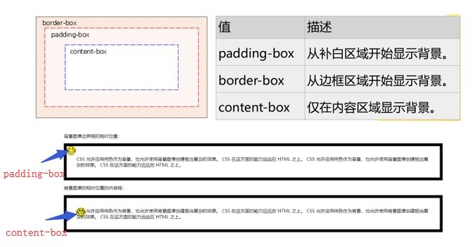

#### 背景样式

##### 常用的背景样式

- 背景色：background-color

```css
background-color: gray;
background-color: #808080;
background-color: rgb(128,128,128);
```

+ 背景图像：background-image

```css
body{background-image: url("images/bg.jpg");}
```

+ 背景图片重复：background-repeat

| 值         | 描述                               |
| --------- | -------------------------------- |
| repeat    | 默认。背景图像将在垂直方向和水平方向重复             |
| repeat-x  | 背景图像将在水平方向重复                     |
| repeat-y  | 背景图像将在垂直方向重复                     |
| no-repeat | 背景图像将仅显示一次                       |
| inherit   | 规定应该从父元素继承background-repeat属性的设置 |

+ 背景图片定位：background-position

background-position属性值：

①使用关键字：`background-position:center left`

②使用百分数值：`background-position: 50%  50%`

③使用长度值：`background-position:300px 100px`

```css
/*背景样式综合使用*/
background: #00ff00 url(image/bg.jpg)  no-repeat center;
```

+ 背景图片固定：background-attachment

background-attachment属性设置背景图像是否固定或者随着页面的其余部分滚动。

1. scroll：默认值。背景图像会随着页面的滚动而移动。
2. fixed：当页面的其余部分滚动时，背景图像不会移动。

##### background-size

- 规定背景图片的尺寸
- 语法：`background-size: length| percentage| cover| contain;`

| 值          | 描述                                       |
| ---------- | ---------------------------------------- |
| length     | 以浮点数字和单位组成的长度值来设置背景图像的宽度和高度，如果只设置第一个值，则第二个值会被设置为"auto" |
| percentage | 以父元素的百分比来设置背景图像的宽度和高度，如果只设置第一个值，则第二个值会被设置为"auto" |
| cover      | 保持背景图像本身宽高比例，将图片缩放到正好完全覆盖所定义背景的区域        |
| contain    | 保持背景图像本身宽高比例，将图片缩放到宽度或高度正好适应所定义背景的区域     |


```html
<!DOCTYPE html>
<html>
<head>
	<meta charset="utf-8" />
	<title>背景</title>
	<style type="text/css">
		div{width: 700px;height: 400px;border: 2px solid plum;background-repeat: no-repeat;
	        background-image: url(img/design.jpg);background-size: cover;}
	</style>
</head>
<body>
	<div>图片尺寸</div>
</body>
</html>
```

##### background-origin

- 规定背景图片的定位区域（background-position的参考位置）
- 语法：`background-origin: border-box | padding-box | content-box;`

默认是`padding-box`



```html
<!DOCTYPE html>
<html>
<head>
	<meta charset="utf-8"> 
	<style> 
		div{border:10px solid black;padding:35px;background-image:url(img/smiley.gif);
		background-repeat:no-repeat;background-position:0px 0px;}
		#div1{background-origin: padding-box;}
		#div2{background-origin:content-box;}
	</style>
</head>
<body>
	<p>背景图像边界框的相对位置：</p>
	<div id="div1">
      CSS 允许应用纯色作为背景，也允许使用背景图像创建相当复杂的效果。CSS 在这方面的能力远远在 HTML 之上。CSS 允许应用纯色作为背景，也允许使用背景图像创建相当复杂的效果。CSS 在这方面的能力远远在 HTML 之上。
	</div>
	<p>背景图像的相对位置的内容框：</p>
	<div id="div2">
      CSS 允许应用纯色作为背景，也允许使用背景图像创建相当复杂的效果。CSS 在这方面的能力远远在 HTML 之上。CSS 允许应用纯色作为背景，也允许使用背景图像创建相当复杂的效果。CSS 在这方面的能力远远在 HTML 之上。
	</div>
</body>
</html>
```

##### background-clip

- 规定背景的绘制区域（决定背景在哪些区域显示）。
- 语法：background-clip: border-box| padding-box| content-box;

|      值      | 描述          |
| :---------: | ----------- |
| border-box  | 从边框区域向外裁剪背景 |
| padding-box | 从补白区域向外裁剪背景 |
| content-box | 从内容区域向外裁剪背景 |

##### background-clip与background-origin

- `background-clip：border| padding| content`  指定背景在哪些区域可以显示，但与背景开始绘制的位置无关。背景的绘制的位置可以出现在不显示背景的区域，这时就相当于背景图片被不显示背景的区域裁剪了一部分。
- `background-origin：padding| border| content`  指定背景从哪个区域(边框、补白或内容)开始绘制。可以用此属性在边框上绘制背景，但边框上的背景显不显示出来就要由background-clip来决定了。

```html
<!DOCTYPE html>
<html>
<head>
	<meta charset="utf-8"> 
	<style>
		#example1 {
			width: 800px;
			height: 450px;
			border: 20px dotted black;
			padding: 50px;
		    background-image: url(img/girl.jpg);
		    background-size: 100% 100%;
		    background-repeat: no-repeat;			
			background-clip: padding-box;/*padding-box以外的都要剪辑掉*/
			background-origin: border-box;/*从border-box开始进行剪辑*/
		}
	</style>s
</head>
<body>
	<div id="example1"></div>
</body>
</html>
```

