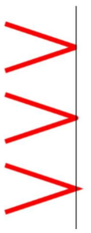

#### 线条的样式

- lineWidth 属性 —— 设置当前线条的宽度，以**像素**计


##### linCap属性

- lineCap 属性 —— 设置线条末端线帽的样式

```javascript
context.lineCap="butt |round |square";
// "round" 和 "square" 会使线条略微变长
```

|   值    |         描述          |
| :----: | :-----------------: |
|  butt  | 默认。向线条的每个末端添加平直的边缘。 |
| round  |   向线条的每个末端添加圆形线帽。   |
| square |  向线条的每个末端添加正方形线帽。   |


##### lineJoin属性

+ lineJoin 属性 —— 设置当两条线交汇时所创建边角的类型

```javascript
context.lineJoin="bevel |round |miter";
/*值    描述
bevel 创建斜角。
round 创建圆角。
miter 默认。创建尖角。*/
```



##### miterLimit属性

+ miterLimit 属性 —— 设置最大斜接长度，默认值为10

```markdown
# 斜接长度指的是在两条线交汇处内角和外角之间的距离。
只有当 lineJoin 属性为 "miter" 时，miterLimit 才有效。
边角的角度越小，斜接长度就会越大。
如果斜接长度超过 miterLimit 的值，边角会以 lineJoin 的"bevel"类型来显示。
context.miterLimit = 5;
```


##### 练习一：绘制五角星


```html
<!--
外顶点坐标
x: Math.cos((18+72*i)/180*Math.PI)* R
y: Math.sin((18+72*i)/180*Math.PI)* R
内顶点坐标
x: Math.cos((54+72*i)/180*Math.PI)* r
y: Math.sin((54+72*i)/180*Math.PI)* r
-->
<!DOCTYPE html>
<html>
	<head>
		<meta charset="UTF-8">
		<title>canvas</title>
		<style>
			#canvas{
				border:1px solid #ccc;
			}
		</style>
	</head>
	<body>
		<canvas id="canvas" width="500" height="500"></canvas>
		<script>
			var canvas = document.querySelector('#canvas'),
				context = canvas.getContext('2d');
			context.translate(250,250);
			for(var i = 0;i<5;i++){
				var a = (18+72*i)/180 *Math.PI,
					b = (54+72*i)/180 * Math.PI;
				context.lineTo(Math.cos(a)*180,-Math.sin(a)*180);
				context.lineTo(Math.cos(b)*80,-Math.sin(b)*80);
			}
			context.fillStyle = 'red';
			context.fill();
			context.stroke();
		</script>
	</body>
</html>

```

##### 练习二：绘制一片星空


① 绘制背景

② 循环设置多个五角星。使大小随机，位置随机，旋转角度随机，设置五角星的填充色，绘制

```html
<!DOCTYPE html>
<html>
	<head>
		<meta charset="UTF-8">
		<title>canvas</title>
		<style>
			#canvas{
				border:1px solid #ccc;
			}
		</style>
	</head>
	<body>
		<canvas id="canvas" width="500" height="500"></canvas>
		<script>
			var canvas = document.querySelector('#canvas'),
				context = canvas.getContext('2d');
			// 绘制背景色
			context.beginPath();
			context.fillStyle = "black";
			context.fillRect(0,0,canvas.width,canvas.height);
			
			// 绘制100个星星
			for(var i = 0;i<100;i++){
				context.beginPath();
				var r = Math.random()*10+10;
				var x = Math.random()*canvas.width;
				var y = Math.random()*canvas.height;
				var a = Math.random()*360;
				for(var j=0;j<5;j++){
					context.lineTo(Math.cos((18+72*j-a)/180*Math.PI)*r+x,
					-Math.sin((18+72*j-a)/180*Math.PI)*r+y);
					context.lineTo(Math.cos((54+72*j-a)/180*Math.PI)*r/2+x,
					-Math.sin((54+72*j-a)/180*Math.PI)*r/2+y);
				}
				context.fillStyle = 'orange';
				context.fill();
			}
			context.stroke();
		</script>
	</body>
</html>
```

#### 画布转换和状态保存

画布转换指的是转换画布的**坐标系**。

##### 平移 translate(dx, dy)

- 平移画布的用户坐标系统，即重新映射画布上的 (0,0) 位置。
- 参数 dx —— 坐标原点沿水平方向的偏移量
- 参数 dy —— 坐标原点沿垂直方向的偏移量

+ **translate() 平移，坐标系会累加平移。**


```javascript
context.beginPath();
context.fillStyle = 'pink';
context.fillRect(0,0,100,100);
// translate
context.beginPath();
context.translate(50,50);
context.fillStyle = 'yellow';
context.fillRect(0,0,100,100);
// translate
context.beginPath();
context.translate(50,50);
context.fillStyle = 'orange';
context.fillRect(0,0,100,100);
```

##### 旋转 rotate(angle)

- 旋转画布的用户坐标系统，即改变坐标系 x 与 y 轴的指向。
- 参数 angle —— 旋转角度，以弧度计。正值表示顺时针方向旋转、负值表示逆时针方向旋转、将角度转换为弧度公式

+ `rotate()` 旋转，坐标系会累加旋转。


```javascript
context.beginPath();
context.fillStyle = randomColor();
context.fillRect(200,0,80,20);
// rotate
context.beginPath();
context.rotate(20/180*Math.PI);
context.fillStyle = randomColor();
context.fillRect(200,0,80,20);
// rotate
context.beginPath();
context.rotate(20/180*Math.PI);
context.fillStyle = randomColor();
context.fillRect(200,0,80,20);
```

##### 缩放 scale(swidth, sheight)

- 缩放画布的用户坐标系统。
- 参数 swidth —— 坐标系 x 轴缩放倍数。
- 参数 sheight —— 坐标系 y 轴缩放倍数。

+ `scale()` 缩放，坐标系会累加缩放。


```javascript
context.beginPath();
context.fillStyle = 'black';
context.fillRect(5,5,80,80);
// scale
context.beginPath();
context.scale(2,2);
context.fillStyle = 'red';
context.fillRect(5,5,80,80);
// scale
context.beginPath();
context.scale(2,2);
context.fillStyle = 'blue';
context.fillRect(5,5,80,80);
```

##### 画布坐标状态保存和恢复

- `save()`：保存当前 canvas 绘图环境的所有属性、坐标变换信息等。
- `restore()`：将绘图环境状态恢复为保存值。
- **可以嵌套式的调用 save( )、restore( ) 方法**。save() 把当前状态的一份拷贝压入到一个保存图像状态的栈中。restore() 是出栈。


##### 练习


```html
<!DOCTYPE html>
<html>
	<head>
		<meta charset="UTF-8">
		<title>canvas</title>
		<style>
			#canvas{
				border:1px solid #ccc;
			}
		</style>
	</head>
	<body>
		<canvas id="canvas" width="500" height="500"></canvas>
		<script>
			var canvas = document.querySelector('#canvas'),
				context = canvas.getContext('2d');
			context.translate(160,30);
			context.globalAlpha = 0.8;
			context.fillStyle = 'cornflowerblue';
			context.fillRect(0,0,100,50);
			for(var i = 0;i<50;i++){
				context.translate(25,25);
				context.scale(0.95,0.95);
				context.globalCompositeOperation = 'xor';
				context.rotate(Math.PI/10);
				context.fillRect(0,0,100,50);
			}
		</script>
	</body>
</html>
```
#### 文字的渲染

##### 绘制填充文字

- `fillText( text, x, y, maxWidth )` 方法：在画布上绘制填色的文本。文本的默认颜色是黑色。

|    参数    | 描述                    |
| :------: | --------------------- |
|   text   | 规定在画布上输出的文本           |
|    x     | 开始绘制文本的 x 坐标位置（相对于画布） |
|    y     | 开始绘制文本的 y 坐标位置（相对于画布） |
| maxWidth | 可选。允许的最大文本宽度，以像素计。    |

- `font` 属性 — 设置画布上文本内容的当前字体属性

```javascript
context.font = "bold 35px 宋体";
context.fillStyle = "Blue";
context.fillText("欢迎大家学习canvas", 30, 100);
```

##### 绘制描边文字

`strokeText( text, x, y, maxWidth )` 方法：在画布上绘制文本（没有填色）。文本的默认颜色是黑色。

|    参数    | 描述                    |
| :------: | --------------------- |
|   text   | 规定在画布上输出的文本           |
|    x     | 开始绘制文本的 x 坐标位置（相对于画布） |
|    y     | 开始绘制文本的 y 坐标位置（相对于画布） |
| maxWidth | 可选。允许的最大文本宽度，以像素计。    |

```javascript
context.font = "25px 幼圆";
context.strokeStyle = "Green";
context.strokeText("欢迎大家学习canvas", 30, 150);
```


##### 其他方法和属性

- `measureText(text)` 方法：返回一个对象，该对象包含以像素计的指定字体宽度。
- `textAlign` 属性（center | end | left | right）：根据锚点，设置文本内容的当前对齐方式。
- `textBaseline` 属性（top | middle | bottom）：根据锚点，设置在绘制文本时的当前文本基线。


##### 综合练习:钟表


```html
<!DOCTYPE html>
<html>
	<head>
		<meta charset="UTF-8">
		<title>time</title>
		<style>
			#canvas{
				border:1px solid #FF0000;
			}
		</style>
	</head>
	<body>
		<canvas id="canvas" width="400" height="400"></canvas>
		<script>
			var canvas = document.querySelector('#canvas'),
				context = canvas.getContext('2d');
			
			function clear() {
			    context.clearRect(0, 0, context.canvas.width, context.canvas.height);
			}
			
			function draw() {
			    clear();
			    // 获取现在对应的时间
			    var date = new Date(),
			    	hours = date.getHours(),
			    	minutes = date.getMinutes(),
			    	seconds = date.getSeconds();
			    hours = hours > 12 ? hours - 12 : hours;
			    var hour = hours + minutes / 60;
			    	minute = minutes + seconds / 60;
			    	
			    context.save();
			    context.translate(200, 200);
			    context.beginPath();
			    
			    //circle
				context.beginPath();
				context.arc(0,0,150,0,2*Math.PI);
				context.lineWidth = 5;
				context.strokeStyle = 'lawngreen';
				context.stroke();
				
				// zhizhen
				context.fillStyle = 'red';
				context.fillRect(0, -138, 3, 15);
				context.save();
				for(var i = 1;i<60;i++){
					context.beginPath();
					context.rotate(Math.PI/30);
					if(i%5  == 0){
						context.fillStyle = 'red';
						context.fillRect(0,-138,3,15);
					}else{
						context.fillStyle = 'black';
						context.fillRect(0,-138,3,8);
					}
					context.closePath();
				}
				context.restore();
				
			    // number
			    context.font = '14px Arial';
			    context.fillStyle = '#000';
			    context.textAlign = 'center';
			    context.textBaseline = 'middle';
			    for (var n = 1; n <= 12; n++) {
			        var theta = (n - 3) * (Math.PI * 2) / 12;
			        var x = 110 * Math.cos(theta);
			        var y = 110 * Math.sin(theta);
			        context.fillText(n, x, y);
			    }
			
			    // hour
			    context.save();
			    var theta = (hour - 3) * 2 * Math.PI / 12;
			    context.rotate(theta);
			    context.beginPath();
			    context.lineWidth = 4.5;
			    context.moveTo(-15, 0);
			    context.lineTo(85, 0);
			    context.strokeStyle = 'purple';
			    context.stroke();
			    context.restore();
			    
			    // minute
			    context.save();
			    var theta = (minute - 15) * 2 * Math.PI / 60;
			    context.rotate(theta);
			    context.beginPath();
			    context.lineWidth = 4.5;
			    context.moveTo(-15,0);
			    context.lineTo(90, 0);
			    context.strokeStyle = 'rgb(255,192,203)';
			    context.stroke();
			    context.restore();
			
			    // second
			    context.save();
			    var theta = (seconds - 15) * 2 * Math.PI / 60;
			    context.rotate(theta);
			    context.beginPath();
			    context.lineWidth = 4;
			    context.arc(0,0,3,0,2*Math.PI);
			    context.arc(80,0,3,0,2*Math.PI)
			    context.moveTo(-15, 0);
			    context.lineTo(100, 0);
			    context.strokeStyle = 'red';
			    context.fillStyle = 'black';
			    context.stroke();
			    context.fill();
			    context.restore();
			
			    context.restore();
			}
			setInterval(draw,1000);
		</script>
	</body>
</html>
```

#### 阴影

- `shadowColor` —— 设置用于阴影的颜色。
- `shadowBlur` —— 设置用于阴影的模糊级别。
- `shadowOffsetX` —— 设置形状与阴影的水平距离，默认值0。
- `shadowOffsetY` —— 设置形状与阴影的水平距离，默认值0。
- 偏移量可正可负。


```html
<!DOCTYPE html>
<html>
<head>
    <meta charset="UTF-8">
    <title>canvas</title>
    <style>
        canvas {
            border: 1px solid red;
        }
    </style>
</head>
<body>
<canvas id="canvas" width="1024" height="550">

</canvas>
<script>
    window.onload = function (){
        var canvas = document.getElementById("canvas");
        var context = canvas.getContext("2d");

        context.shadowColor="rgba(100,100,255,1)";// 背景颜色
        context.shadowBlur=20; // 阴影模糊的级别
        context.shadowOffsetX=20; // 阴影与形状的偏移量
        context.shadowOffsetY=20; // 阴影与形状的偏移量
		// 添加文字
        context.font = "bold 100px 宋体";
        context.fillStyle = "Blue";
        context.fillText("欢迎大家学习canvas", 30,300);
    }
</Script>
```

