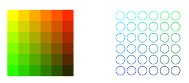
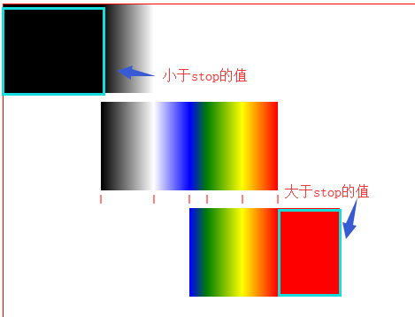
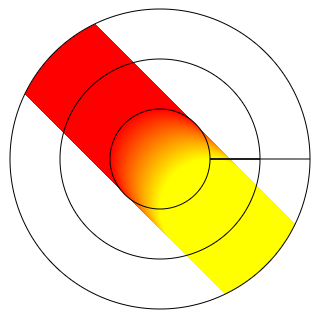
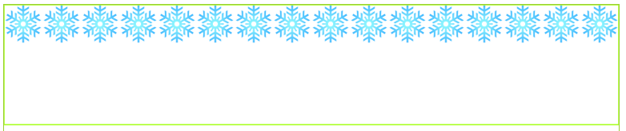

#### 渐变色

##### 颜色

- fillStyle 设置用于填充绘画的颜色。
- strokeStyle 设置用于绘制描边的颜色。



```javascript
var context = document.querySelector('#canvas').getContext('2d');
for(var i = 0;i<6;i++){
  for(var j = 0;j<6;j++){
    // fillStyle
    context.fillStyle = 'rgb(' + Math.floor(255-42.5*i) + ',' +Math.floor(255-42.5*j) +',0)';
  	context.fillRect(j*25,i*25,25,25);
    // strokeStyle
    context.beginPath();
    context.strokeStyle = 'rgb(' + Math.floor(255-42.5*i) + ',' +Math.floor(255-42.5*j) +',0)';
    context.arc(12.5+j*25,12.5+i*25,10,0,2*Math.PI);
    context.storke();
  }
}
```

##### 线性渐变色

canvas 支持线性渐变和放射渐变。
`createLinearGradient(x0,y0,x1,y1)` 创建**线性渐变对象**。使用该**对象**作为 strokeStyle 或 fillStyle 属性的值。

| 参数   | 描述          |
| ---- | ----------- |
| x0   | 渐变开始点的 x 坐标 |
| y0   | 渐变开始点的 y 坐标 |
| x1   | 渐变结束点的 x 坐标 |
| y1   | 渐变结束点的 y 坐标 |

`addColorStop(stop,color)`规定渐变对象中的颜色和停止位置。

- 如果不对 gradient 对象使用该方法，渐变将不可见。为了获得可见的渐变，需要创建至少一个色标。
- 可以多次调用此方法来改变渐变。

| 参数    | 描述                                 |
| ----- | ---------------------------------- |
| stop  | 介于 0.0 与 1.0 之间的值，表示渐变中开始与结束之间的位置。 |
| color | 在结束位置显示的 CSS 颜色值                   |

- 两个临近 stop 距离之间的颜色是过渡颜色。
- 小于最小 stop 的部分会按最小 stop 的 color 来渲染，大于最大 stop 的部分会按最大 stop 的 color 来渲染。
- 渐变可用于填充矩形、圆形、线条、文本等等。



```html
<!DOCTYPE html>
<html>
<head>
    <meta charset="UTF-8">
    <title></title>
    <style>
        canvas {
            border: 1px solid red;
        }
    </style>
</head>
<body>
	<canvas id="canvas" width="1024" height="900"></canvas>
    <script>
        window.onload = function () {
            var canvas = document.getElementById("canvas");
            var context = canvas.getContext("2d");

            context.translate(110,110);
            var grd = context.createLinearGradient(0, 0, 200, 0);

            grd.addColorStop(0, "black");// stop=0;代表x=0*200=0;
            grd.addColorStop(0.3, "white");//stop=0.3;代表x=0.3*200=60; //0到0.3是黑色到白色的过度
            grd.addColorStop(0.5, "blue");
            grd.addColorStop(0.6, "green");
            grd.addColorStop(0.8, "yellow");
            grd.addColorStop(1, "red");//stop=1;代表x=1*200=200; //0.8到1是黄色到红色的过度
            context.fillStyle = grd;

            context.fillRect(0, 0, 200, 100);
            context.fillRect(100,120,170,100);
            context.fillRect(-110,-110,170,100);
        }
    </script>
</body>
</html>
```

##### 放射状/环形渐变

`createRadialGradient(x0,y0,r0,x1,y1,r1)` ：创建放射状/环形的渐变对象。

| 参数   | 描述           |
| ---- | ------------ |
| x0   | 渐变的开始圆的 x 坐标 |
| y0   | 渐变的开始圆的 y 坐标 |
| r0   | 开始圆的半径       |
| x1   | 渐变的结束圆的 x 坐标 |
| y1   | 渐变的结束圆的 y 坐标 |
| r1   | 结束圆的半径       |



```javascript
// 创建渐变对象
var grd = context.createRadialGradient(200, 200, 50, 250, 250, 50);
grd.addColorStop(0, "red");
grd.addColorStop(1, "yellow");

// 填充渐变
context.fillStyle = grd;

context.arc(200, 200, 50, 0, 2 * Math.PI);//渐变开始圆
context.closePath();
context.arc(200, 200, 100, 0, 2 * Math.PI);//渐变结束圆
context.closePath();
context.arc(200, 200, 150, 0, 2 * Math.PI);
context.fill();
context.stroke();
```

#### 图片填充与合成

##### 图案填充、描绘

`createPattern(image, type)`方法

- 在指定的方向内重复指定的元素
- 元素可以是图片、视频，或者其他 `<canvas>` 元素
- 被重复的元素可用于绘制/填充矩形、圆形或线条等

| 参数        | 描述                |
| --------- | ----------------- |
| image     | 规定要使用的图片、画布或视频元素。 |
| repeat    | 默认。该模式在水平和垂直方向重复。 |
| repeat-x  | 该模式只在水平方向重复。      |
| repeat-y  | 该模式只在垂直方向重复。      |
| no-repeat | 该模式只显示一次（不重复）。    |



```javascript
var canvas = document.getElementById("canvas");
var context = canvas.getContext("2d");

var image = new Image();
image.src = 'images/snowflake.png';

image.onload = function(){
  var img = context.createPattern(image, 'repeat-x');
  context.fillStyle = img;
  context.strokeStyle = "greenyellow";
  context.lineWidth = 2;

  context.fillRect(0, 0, 1024, 200);
};
```


