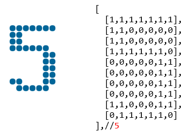
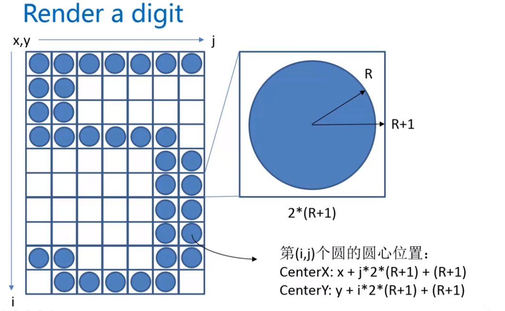

##### 最终实现效果


实现步骤：

+ 在`digit.js`文件中绘制对应的`0-9`和`:` 用一个三维数组进行存储，在三维数组中元素对应1的位置应当用小球进行填充，0的位置不用小球填充。



+ 在`index.html`文件中创建`canvas`标签，引入`JavaScript`文件

```html
<!DOCTYPE html>
<html>
<head lang="en">
    <meta charset="UTF-8">
    <title></title>
</head>
<body>
    <canvas id="canvas" style="display:block;margin:50px auto;">
        当前浏览器不支持Canvas，请更换浏览器后再试
    </canvas>

    <script src="digit.js"></script>
    <script src="countdown.js"></script>
</body>
</html>
```

+ 在`countdown.js`文件中进行绘制相应的倒计时效果



根据上图显示，可以进一步确定所对应的圆心位置

```txt
圆心所在的位置可以用(x,y)进行表示
此时对于第(i,j)个圆的圆心位置相当于是从x的位置加上对应的j*2*(R+1)+(R+1) // j从0开始变化
// 其中设置R+1目的是让圆与圆之间有空隙，更加美观
```

```javascript
var WINDOW_WIDTH = 1024;// 定义屏幕的宽度
var WINDOW_HEIGHT = 768;// 定义屏幕的高度
var RADIUS = 8;// 定义小球的半径
var MARGIN_TOP = 60; //定义距离画布的顶部的位置
var MARGIN_LEFT = 30; // 定义距离画布的左边的位置

const endTime = new Date(2018,9,21,18,47,52);// 结束时间2018年10月21号
var curShowTimeSeconds = 0;// 表示现在倒计时需要多少秒

window.onload = function(){
    var canvas = document.getElementById('canvas');
    var context = canvas.getContext("2d");

    canvas.width = WINDOW_WIDTH;
    canvas.height = WINDOW_HEIGHT;

    curShowTimeSeconds = getCurrentShowTimeSeconds();
    render(context);
}

function getCurrentShowTimeSeconds() {
    var curTime = new Date();
    var ret = endTime.getTime() - curTime.getTime();
    ret = Math.round(ret/1000); //毫秒转化为秒
    return ret >= 0 ? ret : 0;
}

function render( cxt ){

    var hours = parseInt( curShowTimeSeconds / 3600);// hours
    var minutes = parseInt((curShowTimeSeconds-hours*3600)/60);// minutes
    var seconds = curShowTimeSeconds%60;// seconds

    renderDigit(MARGIN_LEFT,MARGIN_TOP, parseInt(hours/10),cxt);// 1
    renderDigit(MARGIN_LEFT + 15*(RADIUS+1) , MARGIN_TOP , parseInt(hours%10) , cxt );// 2
    renderDigit(MARGIN_LEFT + 30*(RADIUS + 1) , MARGIN_TOP , 10 , cxt );
    renderDigit(MARGIN_LEFT + 39*(RADIUS+1) , MARGIN_TOP , parseInt(minutes/10) , cxt);
    renderDigit(MARGIN_LEFT + 54*(RADIUS+1) , MARGIN_TOP , parseInt(minutes%10) , cxt);
    renderDigit(MARGIN_LEFT + 69*(RADIUS+1) , MARGIN_TOP , 10 , cxt);
    renderDigit(MARGIN_LEFT + 78*(RADIUS+1) , MARGIN_TOP , parseInt(seconds/10) , cxt);
    renderDigit(MARGIN_LEFT + 93*(RADIUS+1) , MARGIN_TOP , parseInt(seconds%10) , cxt);
  	// 对于数字相当于是7个小正方形 14*(R+1) 数字与数字之间有一个距离R+1
  	// 对于冒号来说，传入的参数就是数组的第11个元素，下标为10 相当于8*(R+1) 之间的距离R+1
}

function renderDigit( x , y , num , cxt ){

    cxt.fillStyle = "rgb(0,102,153)";
    for( var i = 0 ; i < digit[num].length ; i ++ ){
    	for(var j = 0 ; j < digit[num][i].length ; j ++ ){
    		if( digit[num][i][j] == 1 ){
                cxt.beginPath();
           		cxt.arc( x+j*2*(RADIUS+1)+(RADIUS+1),y+i*2*(RADIUS+1)+(RADIUS+1),RADIUS,0,2*Math.PI );
                cxt.closePath();
                cxt.fill();
            }	
    	}	
    }
}
```

