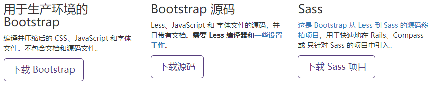
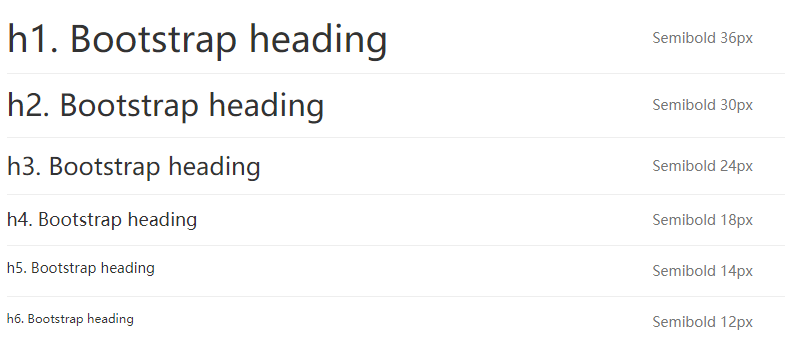
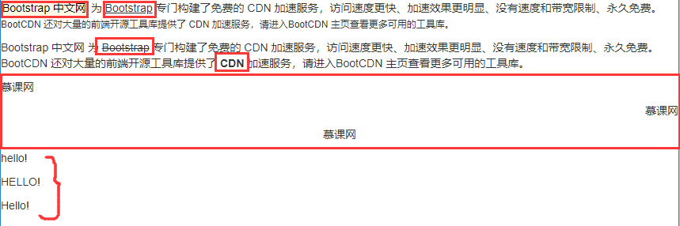

#### Bootstrap

##### Bootstrap简介

- bootstrap是Twitter公司基于HTML、CSS、JavaScript的前端框架
- 为实现web应用程序快速开发提供的一套前端工具包
- 可以利用Bootstrap开发响应式布局和移动设备优先的项目

##### Bootstrap的特性

+ 响应式设计
+ 栅格布局
+ 完整的类库
+ jQuery插件
+ 不同的使用场景

#### Bootstrap环境搭建

Bootstrap （当前版本 v3.3.7）提供以下几种方式帮你快速上手，每一种方式针对具有不同技能等级的开发者和不同的使用场景。继续阅读下面的内容，看看哪种方式适合你的需求吧。



注意：由于Bootstrap的js是运用jquery的js文件，因此需要自己在Bootstrap的js文件夹下自动引入`jquery.min.js`

##### 搭建第一个Bootstrap项目

```html
<!DOCTYPE html>
<html>
<head>
	<title>Bootstrap</title>
	<meta charset="utf-8"/>
	<link rel="stylesheet" type="text/css" href="dist/css/bootstrap.css">
	<script type="text/javascript" src="dist/js/jQuery.min.js"></script>
	<script type="text/javascript" src="dist/js/bootstrap.min.js"></script>
</head>
<body>
	<button>Hello World!</button>
</body>
</html>
```

#### 全局样式

Bootstrap全局样式的特点：代码整洁、风格统一、美观易用

Bootstrap提供了大量的全局样式，基本的HTML元素均可以通过class设置样式并得到增强效果。

##### Bootstrap排版

Bootstrap对默认的排版方式进行了CSS样式定义，使得各种基本结构套用出来的HTML页面更加美观。

Bootstrap排版--标题

- HTML 中的所有标题标签，`<h1> 到 <h6>` 均可使用。另外，还提供了 `.h1` 到 `.h6` 类，为的是给内联（inline）属性的文本赋予标题的样式。
- 标题（h1~h6 / .h1 ~ .h6）
- 副标题（small）



```html
<!DOCTYPE html>
<html>
<head>
	<title>Bootstrap标题</title>
	<meta charset="utf-8"/>
	<link rel="stylesheet" type="text/css" href="css/bootstrap.min.css">
</head>
<body>
	<h1>标题一<small>小标题</small></h1>
	<h2>标题二</h2>
	<h3>标题三</h3>
	<h4>标题四</h4>
	<h5>标题五</h5>
	<h6>标题六</h6>
	<span class="h1">标题一</span>
	<span class="h2">标题一</span>
	<span class="h3">标题一</span>
	<span class="h4">标题一</span>
	<span class="h5">标题一</span>
	<span class="h6">标题一</span>
</body>
</html>
```

Bootstrap排版--文本

- 段落：`p标签` 默认--14px、行高--20px、底部外边距--10px（普通网页默认大小为16px）
- 对齐方式：`.text-left | .text-center | .text-right` 
- 大小写：`.text-lowercase | .text-uppercase | .text-capitalize`
- 文本标记：`<mark></mark> | <u></u> | <ins></ins> | <del></del> | <strong></strong>` 



```html
<!DOCTYPE html>
<html>
<head>
	<title>Bootstrap标题</title>
	<meta charset="utf-8"/>
	<link rel="stylesheet" type="text/css" href="css/bootstrap.min.css">
</head>
<body>
	<p><mark>Bootstrap 中文网</mark> 为 <ins>Bootstrap</ins> 专门构建了免费的 CDN 加速服务，访问速度更快、加速效果更明显、没有速度和带宽限制、永久免费。<small>BootCDN 还对大量的前端开源工具库提供了 CDN 加速服务，请进入BootCDN 主页查看更多可用的工具库。</small></p>
	<p>Bootstrap 中文网 为 <del>Bootstrap</del> 专门构建了免费的 CDN 加速服务，访问速度更快、加速效果更明显、没有速度和带宽限制、永久免费。BootCDN 还对大量的前端开源工具库提供了 <strong>CDN</strong> 加速服务，请进入BootCDN 主页查看更多可用的工具库。</p>
	<p class="text-left">慕课网</p>
	<p class="text-right">慕课网</p>
	<p class="text-center">慕课网</p>
	<p class="text-lowercase">HELLO!（所有字母小写）</p>
	<p class="text-uppercase">hello!（所有字母大写）</p>
	<p class="text-capitalize">hello!（首字母大写）</p><!--首字母大写-->
</body>
</html>
```

